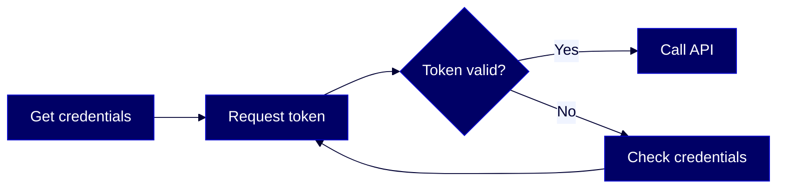
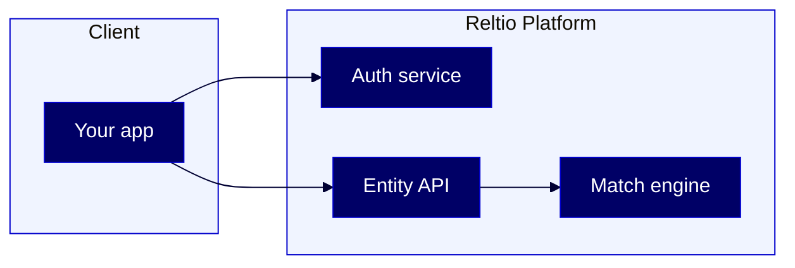
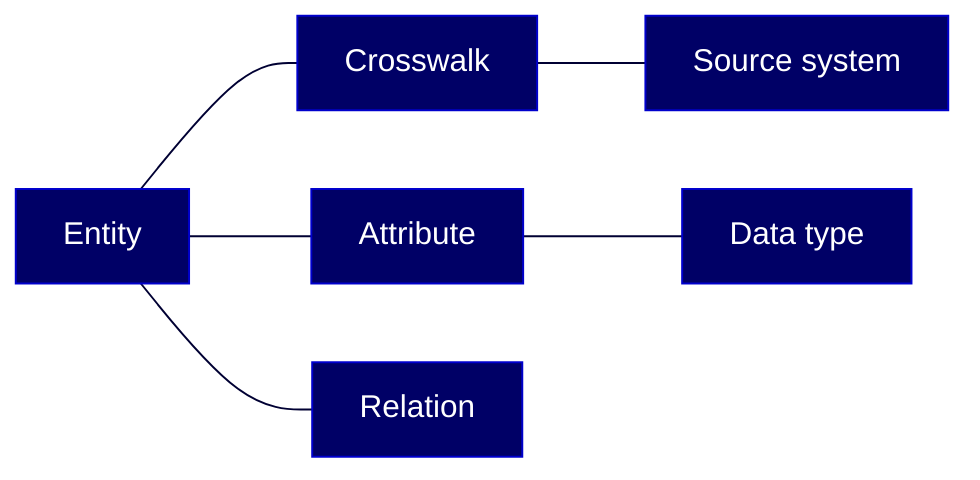

# Reltio HOWTO Structure Guide

Every Reltio HOWTO follows a consistent document skeleton so readers always know where they are and what comes next. This guide covers layout, section ordering, workflow diagrams, glossary, per-section source links, and content depth. The companion [STYLE-GUIDE.md](STYLE-GUIDE.md) handles voice, writing conventions, code blocks, tables, and callouts.

_Sources: [Microsoft Writing Style Guide](https://learn.microsoft.com/en-us/style-guide/), existing Reltio HOWTOs (`howtos/HOWTO-authenticate-and-use-reltio-apis.md`, `howtos/HOWTO-top-10-reltio-apis.md`, `howtos/HOWTO-SETUP-for-top-10-reltio-apis.md`), original framework by Vaisakh._

---

## Part A: Document skeleton

Every HOWTO follows this exact order. Do not rearrange sections.

```
# HOWTO: [Action phrase]

[Opening line — one sentence]

[Diagram — ONLY if applicable (see A4)]

## Overview
[2–3 sentences + "Who this guide is for" line — under 80 words total]

## Contents
1. [Getting started](#1-getting-started)
2. [Key concepts](#2-key-concepts)
3. [First section](#3-first-section)
4. [Second section](#4-second-section)
N. [Troubleshooting](#n-troubleshooting)
N. [Further reading](#n-further-reading)
N. [Glossary](#n-glossary)

## 1. Getting started

## 2. Key concepts

## 3. [First section]
## 4. [Second section]
## N. [Troubleshooting]

## N. [Further reading]

## N. [Glossary]

---
> **Disclaimer:** AI-generated from the Reltio documentation snapshot [TIMESTAMP] ([TOPIC_COUNT] topics). AI output can contain subtle inaccuracies, and the knowledge base syncs twice a week — so the content here may lag [docs.reltio.com](https://docs.reltio.com). Verify anything critical against the official docs and your own tenant. Full disclaimer: [DISCLAIMER.md](../DISCLAIMER.md).
```

---

### A1. Title format

Use `# HOWTO: [Action phrase]`. The action phrase starts with a verb and describes what the reader will accomplish.

| Good | Bad |
|------|-----|
| `# HOWTO: Authenticate and use Reltio APIs` | `# Reltio authentication guide` |
| `# HOWTO: Set up a Reltio tenant for API testing` | `# Tenant setup` |
| `# HOWTO: Configure match rules in Reltio` | `# Match rules overview` |

---

### A2. Opening line

One sentence immediately below the title. It tells the reader what they'll be able to do after finishing the guide. No heading, no blank line between the title and this sentence.

```markdown
# HOWTO: Authenticate and use Reltio APIs

Everything starts here — you'll exchange your Client ID and Client Secret for an access token, then use it to call Reltio's most common endpoints.
```

---

### A3. Guide overview

The `## Overview` section has two jobs:

1. **What and why** — 2–3 sentences explaining the guide's scope and value.
2. **Audience line** — a single sentence identifying the Reltio roles this guide is for, followed by a cross-reference to the canonical roles page.

Keep the entire section under 80 words.

```markdown
## Overview

This guide walks you through authenticating with the Reltio platform and making your first API calls. You'll learn how to get an access token, create and read entities, and handle common errors. By the end, you'll have a working Postman collection you can reuse.

This guide is for this Reltio role: **Developer**. For more information on data unification roles in the Reltio Context Intelligence Platform, see [About roles](https://docs.reltio.com/en/roles/about-roles).
```

#### Canonical roles — required

The audience line must use **only** the 7 canonical Reltio user roles defined in [About roles](https://docs.reltio.com/en/roles/about-roles). Bold each role and match the exact casing (singular, as listed):

- **Business User**
- **Data Product Owner**
- **Data Steward**
- **Developer**
- **Reltio Configurator**
- **Solution Architect**
- **System Administrator**

**Format:** the audience line is a plain prose sentence (not a bold label) with role names bolded and comma-separated. Switch between "role" and "roles" based on count:

- **Single role:**
  ```markdown
  This guide is for this Reltio role: **Developer**. For more information on data unification roles in the Reltio Context Intelligence Platform, see [About roles](https://docs.reltio.com/en/roles/about-roles).
  ```
- **Multiple roles:**
  ```markdown
  This guide is for these Reltio roles: **Data Steward**, **Reltio Configurator**. For more information on data unification roles in the Reltio Context Intelligence Platform, see [About roles](https://docs.reltio.com/en/roles/about-roles).
  ```

The link always points to the production docs page (`https://docs.reltio.com/en/roles/about-roles`), never staging.

Do **not** invent roles like "data modeler", "integration engineer", "data engineer", or "integration developer". Map them to the closest canonical role:

| You might be tempted to write… | Use instead |
|---|---|
| data modeler | **Solution Architect** or **Reltio Configurator** |
| integration engineer | **Developer** |
| data engineer | **Developer** or **Reltio Configurator** |
| admin | **System Administrator** |
| architect | **Solution Architect** |
| business analyst / business user | **Business User** |

---

### A4. Overview diagram (conditional)

Not every guide needs a diagram. When a guide does include one, place it between the opening line and the `## Overview` section.

#### When to include a diagram

- The guide has **3 or more procedural steps** that form a clear workflow.
- The guide covers **architecture or system integration** with multiple components.
- The concept involves **branching logic** (if/then paths, retry loops, error handling).
- A visual would **save the reader 200+ words** of prose explanation.

#### When NOT to include a diagram

- The guide is a **single linear procedure** with no branching (a numbered list is enough).
- The guide is a **quick reference card** or glossary-only document.
- The concept is **simple enough** that one sentence explains it.
- Adding a diagram would **repeat** what the procedural steps already show.

#### Reltio brand colors

All diagrams use Reltio brand colors. Add this init block at the top of every Mermaid code fence — **copy it verbatim, including the `themeCSS` line**:

````markdown
```mermaid
%%{init: {'theme': 'base', 'themeVariables': {'primaryColor': '#000066', 'primaryTextColor': '#ffffff', 'primaryBorderColor': '#0000CC', 'lineColor': '#000033', 'textColor': '#000033', 'secondaryColor': '#f5f5f5', 'tertiaryColor': '#f0f4ff', 'edgeLabelBackground': '#f0f4ff', 'clusterBkg': '#f0f4ff', 'clusterBorder': '#0000CC'}, 'themeCSS': '.edgeLabel { color: #000033 !important; background-color: #f0f4ff !important; font-weight: 500 !important; } .edgeLabel rect, .edgeLabel foreignObject { fill: #f0f4ff !important; }', 'flowchart': {'nodeSpacing': 40, 'rankSpacing': 55, 'curve': 'basis', 'padding': 12}}}%%
```
````

Color reference:

| Name | Hex | Usage |
|------|-----|-------|
| Midnight | `#000033` | Line/edge color, edge-label text |
| Blue | `#000066` | Primary node background |
| Bright Blue | `#0000CC` | Borders, cluster borders |
| Soft Blue | `#f0f4ff` | Cluster (subgraph) background, edge-label background |
| Gold | `#FFCC00` | Optional accent, not in default palette |
| White | `#ffffff` | Text on dark node backgrounds |

#### Why the `themeCSS` line is required

Mermaid's base theme paints edge labels (`-- Yes -->`, `-. Label .-`, etc.) with `primaryTextColor`. Since our `primaryTextColor` is white for readable text on dark nodes, edge labels would render as **white text on a near-white background — invisible**. The `themeCSS` block in the init injects raw CSS with `!important` that forces edge labels to dark `#000033` on soft-blue `#f0f4ff`. Without that line, any edge label is barely readable. Never strip it from the init block.

#### Layout direction rules

**Always use `flowchart LR` (left-to-right, landscape).** Landscape diagrams keep the vertical footprint small so the reader reaches the first body section without a long scroll, and left-to-right flow matches natural reading order for a step-by-step process. In the self-contained HTML renders the SVG scales to the page width automatically, and on GitHub's markdown renderer the diagram fits the content column cleanly — top-down layouts produce a tall narrow column that renders poorly in both environments.

For long linear chains (10+ nodes) you can break the flow into two LR rows using a subgraph wrap, but do not switch to `flowchart TD`.

**Keep node labels short — 2 to 3 words, verbs first.** Long labels force nodes wider and, in LR layout, push the whole diagram past the reading column. Put nuance in the surrounding prose, not inside the node.

| Too long | Tight |
|----------|-------|
| `Source record posted to Reltio` | `New source record` |
| `Concatenate configured attributes in order` | `Concatenate attributes` |
| `Surrogate crosswalk assigned` | `Crosswalk assigned` |

#### Diagram types

**Workflow diagram** — use `flowchart LR` for step-by-step processes (landscape default).

````markdown

````

**Architecture diagram** — landscape outer flow with subgraphs that stack internally (`direction TB`) so clusters stay compact.

````markdown

````

**Concept map** — use for showing relationships between ideas or components without a strict sequence. Always landscape (`flowchart LR`) — never switch to `flowchart TD`, even for large maps. If an LR map grows too wide, break it into subgraphs or split it into two diagrams rather than flipping to portrait.

````markdown

````

#### Generating SVGs (optional)

After saving your HOWTO, you can optionally run:

```bash
node generate-diagrams.js
```

This converts Mermaid blocks to SVG files. This step is **not required** — Mermaid renders natively on Bitbucket and GitHub.

---

### A5. Contents format

Use a single ordered list covering every top-level section. Number `1.` through `N.` in the order the sections appear in the guide. No mixed bullets — everything is numbered. The numbering is a navigation aid, not a claim that every section is a sequential procedure.

```markdown
## Contents

1. [Getting started](#1-getting-started)
2. [Key concepts](#2-key-concepts)
3. [Authenticate and get a token](#3-authenticate-and-get-a-token)
4. [Create an entity](#4-create-an-entity)
5. [Read an entity by URI](#5-read-an-entity-by-uri)
6. [Troubleshooting](#6-troubleshooting)
7. [Further reading](#7-further-reading)
8. [Glossary](#8-glossary)
```

Every body heading must match its Contents number: `## 1. Getting started`, `## 2. Key concepts`, and so on. TOC anchors resolve to the numeric-prefixed slugs (e.g., `#1-getting-started`).

---

### A6. Getting started

The first numbered section of every HOWTO is `## 1. Getting started`. List what the reader needs before starting — exact software versions, required permissions, links to setup guides. Lead with a short sentence before the bullet list.

```markdown
## 1. Getting started

Gather these before you begin:

- A Reltio sandbox tenant ([request one here](https://example.com))
- Your **Client ID** and **Client Secret** (found in the Reltio Console under API access)
- [Postman](https://www.postman.com/downloads/) v10 or later (or `curl`)
- Completed the [HOWTO: Set up a Reltio tenant](howtos/HOWTO-SETUP-for-top-10-reltio-apis.md) guide
```

---

### A7. Footer

Every HOWTO ends with a single, brief Disclaimer block. No Attribution block.

The Disclaimer reminds readers that the guide is AI-generated, time-boxed to a `docs.md` snapshot, and subject to drift because the knowledge base syncs twice a week. It then links to the full `DISCLAIMER.md` in the repo root for the complete caveat. The snapshot timestamp and topic count must be pulled live from the `reltio-docs/docs.md` header at generation time — do not hardcode.

**How to extract the values:**

The first 10 lines of `reltio-docs/docs.md` contain these fields:

```
# Reltio Documentation

_Generated: 2026-04-22 02:14 UTC_

_Topics: 3233_
```

Parse `_Generated: (.+)_` for the timestamp and `_Topics: (\d+)_` for the topic count. Format the topic count with a thousands separator if it has four or more digits (`3,233`). Substitute both values into the disclaimer template.

**Disclaimer template:**

```markdown
---

> **Disclaimer:** AI-generated from the Reltio documentation snapshot [TIMESTAMP] ([TOPIC_COUNT] topics). AI output can contain subtle inaccuracies, and the knowledge base syncs twice a week — so the content here may lag [docs.reltio.com](https://docs.reltio.com). Verify anything critical against the official docs and your own tenant. Full disclaimer: [DISCLAIMER.md](../DISCLAIMER.md).
```

---

### A8. Horizontal rules

Use `---` (three hyphens) in exactly one place: immediately before the Disclaimer footer. Nowhere else.

Do not scatter horizontal rules between sections — they add visual noise and confuse the reader about where the content ends.

---

## Part B: Section types

### B1. All top-level sections are numbered

Every top-level section (`##`) is numbered sequentially — `## 1.`, `## 2.`, `## 3.`, through `## N.` — in the order the sections appear. The numbers match the entries in the Contents list one-for-one.

The numbering is a navigation and anchor-link convention, not a claim that every section is a step the reader must follow in sequence. Conceptual sections (Key concepts, Troubleshooting, Glossary) are still informational — readers can scan or skip them — but they carry numbers so the Contents list stays a single ordered list.

```markdown
## 1. Getting started        ← numbered
## 2. Key concepts           ← numbered (informational, but still numbered)
## 3. Get an access token    ← numbered
## 4. Create an entity       ← numbered
## 5. Troubleshooting        ← numbered
## 6. Further reading        ← numbered
## 7. Glossary               ← numbered
```

---

### B2. Per-section source links

Every major section should end with a "Learn more" link pointing the reader to authoritative source material.

```markdown
> **Learn more:** [Authentication overview](https://docs.reltio.com/auth/) in the Reltio documentation.
```

Rules:
- Place the link at the **end** of the section, after any code blocks or tables.
- Use the `> **Learn more:**` format consistently across all HOWTOs.
- Link to the **most specific page** — don't link to the docs homepage.
- Prefer official Reltio documentation. Use Reltio Community, blog posts, or third-party sources only when the official docs lack coverage.

In addition to per-section links, every HOWTO has a consolidated **Further reading** section near the end:

```markdown
## Further reading

- [Reltio API reference](https://docs.reltio.com/api/)
- [Reltio Community: authentication FAQ](https://community.reltio.com/)
- [OAuth 2.0 client credentials flow (RFC 6749)](https://datatracker.ietf.org/doc/html/rfc6749#section-4.4)
```

---

### B3. Mandatory glossary section

Every HOWTO ends with a `## Glossary` section. It defines every Reltio-specific or technical term used in the guide.

Rules:
- **Alphabetical order** — sort terms A-Z.
- **Format** — `**Term:** definition` on a single line, one blank line between entries.
- **First use** — the first time a glossary term appears in the body, link it to the glossary: `[crosswalk](#glossary)`.
- **Keep it tight** — one or two sentences per definition. If a term needs a paragraph, it belongs in Key concepts, not the glossary.

```markdown
## Glossary

**Access token:** A short-lived credential (valid for 60 minutes) that authenticates your API requests. You get one by sending your Client ID and Client Secret to the auth endpoint.

**Crosswalk:** A reference that links a Reltio entity back to its record in a source system. Each crosswalk includes a source name and a source-system identifier.

**Entity:** The core data object in Reltio. An entity represents a person, organization, product, or other real-world object, with attributes and relations.

**URI:** The unique identifier Reltio assigns to every entity. Format: `entities/{id}`.
```

---

## Part C: API tutorial steps

API tutorials are the most common HOWTO type. Every procedural step follows this pattern:

```markdown
## N. [Action phrase]

`METHOD /endpoint`

[1–2 sentences of context: what this step does and why it matters.]

**Request**

```bash
curl -X POST "https://auth.reltio.com/oauth/token" \
  -H "Content-Type: application/x-www-form-urlencoded" \
  -d "grant_type=client_credentials&client_id=YOUR_ID&client_secret=YOUR_SECRET"
```

**Response**

```json
{
  "access_token": "eyJhbGci...",
  "token_type": "bearer",
  "expires_in": 3600
}
```

### Why this matters

[Optional — 1–2 sentences explaining the significance of this response or behavior.]

### How it works

[Optional — 1–2 sentences on the underlying mechanism, only if it helps the reader.]

### Key rules

- [Constraint or important detail]
- [Another constraint]
- [One more if needed]

### What can go wrong

| Symptom | Cause | Fix |
|---------|-------|-----|
| `401 Unauthorized` | Expired or invalid token | Re-authenticate (step 1) |
| `400 Bad Request` | Malformed JSON body | Validate your JSON with a linter |
| `404 Not Found` | Wrong entity URI | Double-check the URI from the create response |

> **Learn more:** [Endpoint reference](https://docs.reltio.com/api/endpoint) in the Reltio documentation.
```

### Step structure summary

| Element | Required? | Notes |
|---------|-----------|-------|
| `## N. [Action phrase]` | Yes | Numbered heading |
| API line (`METHOD /endpoint`) | Yes | Inline code, immediately after heading |
| Context sentences | Yes | 1–2 sentences max |
| Request code block | Yes | `bash` or `http` fence |
| Response code block | Yes | `json` fence |
| Why this matters | No | Include when non-obvious |
| How it works | No | Include when the mechanism matters |
| Key rules | Yes | Bullet list of constraints |
| What can go wrong | Yes | Table with Symptom / Cause / Fix |
| Learn more link | Yes | Per-section source link |

---

## Part D: Configuration and setup guides

Not every HOWTO is an API tutorial. Configuration and setup guides walk the reader through system setup, tenant configuration, or environment preparation. They follow the same document skeleton (Part A) but have different content expectations.

### What to include

**Component table** — list every component the reader will configure, with its purpose and where to find it.

```markdown
| Component | Purpose | Location |
|-----------|---------|----------|
| L3 configuration | Defines entity types and attributes | Reltio Console > Configuration |
| Match rules | Controls how duplicates are detected | Reltio Console > Match rules |
| Cleanse rules | Standardizes data on ingest | Reltio Console > Cleanse |
```

**Configuration tree diagram** — use a Mermaid diagram (see A4) to show how configuration objects relate to each other. This is especially useful for L3 configurations, match rule hierarchies, or multi-tenant setups.

**Design choice explanations** — when there are multiple valid approaches, explain why you chose this one. Use a brief "Why this approach" callout:

```markdown
> **Why this approach:** We use role-based entity types instead of a single generic entity type because it simplifies match rules and makes the data model self-documenting.
```

**Mapping table** — if the guide involves mapping source fields to Reltio attributes, include a mapping table:

```markdown
| Source field | Reltio attribute | Type | Notes |
|--------------|------------------|------|-------|
| `first_name` | `FirstName` | String | Required |
| `ssn` | `SSN` | String | PII — mask in logs |
| `dob` | `DateOfBirth` | Date | Format: `yyyy-MM-dd` |
```

**Troubleshooting section** — cover common configuration errors, validation failures, and how to diagnose them.

**Reset / rollback instructions** — tell the reader how to undo or reset the configuration if something goes wrong. This is critical for tenant setup guides.

---

## Part E: Quick reference cards

For guides that run **500+ lines**, add a quick reference card at the end (before the Glossary). The card gives experienced readers a shortcut — they can skip the explanations and just grab the essentials.

### What to include

- **Endpoint summary table** (for API tutorials):

```markdown
## Quick reference

| Step | Method | Endpoint | Key header |
|------|--------|----------|------------|
| 1 | POST | `/oauth/token` | `Content-Type: application/x-www-form-urlencoded` |
| 2 | POST | `/entities` | `Authorization: Bearer {token}` |
| 3 | GET | `/entities/{uri}` | `Authorization: Bearer {token}` |
```

- **Configuration checklist** (for setup guides):

```markdown
## Quick reference

- [ ] Tenant created and accessible
- [ ] L3 configuration uploaded
- [ ] Match rules configured
- [ ] Test entity created and verified
- [ ] Team member access granted
```

- **Common commands** (for CLI-focused guides):

```markdown
## Quick reference

| Task | Command |
|------|---------|
| Get token | `curl -X POST ...` |
| Create entity | `curl -X POST ...` |
| Search | `curl -G ...` |
```

---

## Part F: File naming

All HOWTOs live in the `howtos/` directory. Use this naming pattern:

```
howtos/HOWTO-[kebab-case-action-phrase].md
```

Rules:
- Start with `HOWTO-` (uppercase).
- Use **kebab-case** for the action phrase (lowercase, hyphens between words).
- The action phrase should match or closely resemble the title's action phrase.
- Keep filenames under 60 characters when possible.

| Title | Filename |
|-------|----------|
| HOWTO: Authenticate and use Reltio APIs | `HOWTO-authenticate-and-use-reltio-apis.md` |
| HOWTO: Set up a Reltio tenant for API testing | `HOWTO-SETUP-for-top-10-reltio-apis.md` |
| HOWTO: Configure match rules in Reltio | `HOWTO-configure-match-rules.md` |
| HOWTO: Top 10 Reltio APIs | `HOWTO-top-10-reltio-apis.md` |

---

## Part G: Content depth

### Guide length targets

| Guide type | Target length | Upper limit |
|------------|--------------|-------------|
| API tutorial (single endpoint) | 300–500 lines | 800 lines |
| API tutorial (multi-endpoint) | 500–1000 lines | 1500 lines |
| Configuration / setup guide | 400–800 lines | 1200 lines |
| Quick reference card (standalone) | 100–200 lines | 300 lines |

### What to include

- **Every step the reader must take** to go from zero to done.
- **The most common error** for each step and how to fix it.
- **One worked example** per step (request + response for API tutorials, screenshot or config snippet for setup guides).
- **Links to source material** for anything you summarize.

### What to skip

- **Exhaustive API reference** — link to the official docs instead of listing every parameter.
- **Edge cases that affect less than 10% of readers** — mention them in a "Learn more" link.
- **Historical context** — the reader doesn't need to know why the API changed in v3.
- **Multiple ways to do the same thing** — pick the best approach, mention alternatives in a single sentence.

### Depth ceiling rule

A HOWTO section should **not exceed 2x the length** of its source material. If the official Reltio docs cover a topic in 200 words, your HOWTO section for that topic should not exceed 400 words. The HOWTO's job is to make the source material actionable, not to rewrite it. If you find yourself exceeding 2x, you're either:

1. **Including too much background** — move it to Key concepts or link to the source.
2. **Covering too many edge cases** — keep the main path, link the rest.
3. **Explaining something that should be a diagram** — draw it instead of writing it.

---

## Structure checklist

Use this checklist before submitting a HOWTO for review. Every item must pass.

### Document skeleton
- [ ] Title uses `# HOWTO: [Action phrase]` format
- [ ] Opening line is one sentence, immediately below the title
- [ ] Diagram included (if applicable) between opening line and Overview
- [ ] Diagram uses Reltio brand colors and the standard Mermaid init block verbatim — including the `themeCSS` line that makes edge labels readable (if applicable)
- [ ] Diagram declares `flowchart LR` (landscape) — **never** `flowchart TD`. For long linear flows, wrap into subgraph rows inside LR instead of flipping to portrait
- [ ] `## Overview` section is under 80 words and includes the audience line
- [ ] Audience line uses only the 7 canonical Reltio roles, bolded with exact singular casing, followed by the cross-reference sentence to [About roles](https://docs.reltio.com/en/roles/about-roles) (see A3)
- [ ] "role" (singular) is used when exactly one role is listed, "roles" (plural) when two or more
- [ ] `## Contents` uses a single ordered list (1 through N) covering every top-level section
- [ ] `## 1. Getting started` lists specific requirements with versions and links
- [ ] Disclaimer footer is present, with snapshot timestamp and topic count pulled from the `docs.md` header
- [ ] Exactly one `---` horizontal rule, placed immediately before the Disclaimer footer

### Section structure
- [ ] Every top-level section is numbered (`## 1.`, `## 2.`, …, `## N.`) and matches its Contents entry
- [ ] Every major section ends with a `> **Learn more:**` link where a source page exists
- [ ] `## N. Further reading` section consolidates all external references

### Glossary
- [ ] `## Glossary` section exists
- [ ] Terms are in alphabetical order
- [ ] Format is `**Term:** definition`
- [ ] First use of each glossary term in the body links to `#glossary`

### API tutorial steps (if applicable)
- [ ] Each step has: numbered heading, API line, context, Request, Response, Key rules, What can go wrong table, Learn more link
- [ ] Request blocks use `bash` fence
- [ ] Response blocks use `json` fence

### Configuration guides (if applicable)
- [ ] Component table included
- [ ] Design choices explained
- [ ] Reset / rollback instructions provided

### Content depth
- [ ] Guide length falls within the target range for its type
- [ ] No section exceeds 2x the length of its source material
- [ ] Quick reference card included if the guide exceeds 500 lines

### File naming
- [ ] File is in `howtos/` directory
- [ ] Filename matches `HOWTO-[kebab-case].md` pattern
