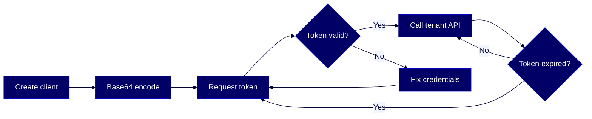

# HOWTO: Authenticate and use Reltio APIs

Exchange your Client ID and Client Secret for an access token, then use that token to call Reltio's REST APIs.



## Overview

This guide walks you through authenticating with Reltio using the OAuth 2.0 client credentials grant, then making your first authenticated call to a tenant endpoint. You'll create an application client, fetch an access token, reuse it within its validity window, and know what to do when it expires or gets revoked.

This guide is for this Reltio role: **Developer**. For more information on data unification roles in the Reltio Context Intelligence Platform, see [About roles](https://docs.reltio.com/en/roles/about-roles).

## Contents

1. [Getting started](#1-getting-started)
2. [Key concepts](#2-key-concepts)
3. [Create an application client](#3-create-an-application-client)
4. [Get an access token](#4-get-an-access-token)
5. [Make your first tenant API call](#5-make-your-first-tenant-api-call)
6. [Refresh, revoke, and reuse tokens](#6-refresh-revoke-and-reuse-tokens)
7. [Troubleshooting](#7-troubleshooting)
8. [Further reading](#8-further-reading)
9. [Glossary](#9-glossary)

## 1. Getting started

Gather these before you begin:

- A Reltio tenant and its tenant ID (for example, `HKlMR3wNbRT3PMo`).
- Your environment URL (for example, `https://na07-prod.reltio.com`). Your tenant URL is `https://{environment}.reltio.com/reltio/api/{tenantId}`.
- A Reltio customer admin (or a user with **Auth.Customer.Clients CREATE** permission) who can create an [application client](#glossary) for you. Only customer administrators and users with customer client management permissions can create application clients.
- A terminal with `curl` (and optionally `jq` for pretty JSON).
- Familiarity with HTTP and [OAuth 2.0](#glossary) basics.

> **Tip:** If your tenant is configured for SSO, you must obtain access tokens from your SSO Auth server instead of the Reltio Auth API. This guide covers the client credentials flow for machine-to-machine integrations.

> **Learn more:** [Authentication API overview](https://docs.reltio.com/en/developer-resources/system-administration-apis/system-administration-apis-at-a-glance/authentication-api) in the Reltio documentation.

## 2. Key concepts

Reltio's Authentication API implements [OAuth 2.0](#glossary). It's a centralized service — not tenant-specific — that issues an [access token](#glossary) you then send to every tenant API call.

- **Client credentials grant** — machine-to-machine authentication. You trade a [Client ID](#glossary) and [Client Secret](#glossary) for an access token. No user is associated with the client; the application is authenticated with the default `[ROLE_API](#glossary)` role plus any scopes you configure.
- **[Bearer token](#glossary)** — Reltio's token type is always `bearer`. You send it as `Authorization: Bearer <accessToken>` on every Reltio API request.
- **Token validity** — access tokens expire after `3600` seconds (one hour) by default. In RDBMS mode, values above `3600` seconds are rejected with a validation error.
- **No refresh token with client credentials** — per the OAuth 2.0 spec, the client credentials grant does not issue a refresh token. When the access token expires, request a new one.
- **IP whitelisting** — the Authentication API itself is not IP-whitelisted; whitelisting is enforced when the token is used against tenant-specific endpoints (for example, `/entities/_scan`). Requests from non-whitelisted IPs fail with `403 Forbidden` even with a valid token.

> **Learn more:** [Access Reltio APIs](https://docs.reltio.com/en/developer-resources/system-administration-apis/system-administration-apis-at-a-glance/authentication-api/access-reltio-apis) in the Reltio documentation.

## 3. Create an application client

`POST https://auth.reltio.com/oauth/customers/{customerId}/clients`

Before you can request a token, someone with customer admin rights must create an application client for you. You can also use the **Client Credentials** app in Reltio Console — the API below is the programmatic equivalent.

> **Note:** Reltio recommends creating one client per tenant access (or per use case) so that the application or service using the credential can be easily identified and managed.

**Request**

```bash @illustrative
curl -s -X POST "https://auth.reltio.com/oauth/customers/YOUR_CUSTOMER_ID/clients" \
  -H "Authorization: Bearer ${ADMIN_TOKEN}" \
  -H "Content-Type: application/json" \
  -d '[
    {
      "clientId": "test_client",
      "clientPermissions": {
        "roles": {
          "ROLE_ADMIN_TENANT": ["tenant1"],
          "ROLE_API": ["tenant1"]
        }
      },
      "authorizedGrantTypes": ["client_credentials"],
      "defaultRolesAssignmentEnabled": false,
      "clientAuthenticationMethods": [
        "client_secret_post",
        "client_secret_basic"
      ]
    }
  ]' | jq .
```

**Response**

```json @output
{
  "clientId": "test_client",
  "clientSecret": "YZze8&7EU%xqH3%8",
  "clientPermissions": {
    "roles": {
      "ROLE_ADMIN_TENANT": ["tenant1"],
      "ROLE_API": ["tenant1"]
    }
  },
  "authorizedGrantTypes": ["client_credentials"],
  "clientAuthenticationMethods": ["client_secret_post", "client_secret_basic"],
  "enabled": true
}
```

### Key rules

- **Role and permission** — you need either the `ROLE_ADMIN_CUSTOMER` role or the `Auth.Customer.Clients CREATE` permission to call this endpoint.
- **Authentication methods** — `client_secret_basic` lets you send the secret in the `Authorization` header; `client_secret_post` lets you send it in the request body.
- **Client secret** — if you don't set `clientSecret`, Reltio generates a secure random secret and returns it exactly once. Copy it immediately and store it in a secret manager.
- **[Access token](#glossary) validity** — if you omit `accessTokenValidity`, the default is `3600` seconds. In RDBMS mode, values above `3600` seconds are rejected.

### What can go wrong

| Symptom | Cause | Fix |
|---------|-------|-----|
| `401 Unauthorized` | The admin token in `Authorization` is expired or wrong | Re-authenticate the admin user and retry |
| Validation error on `accessTokenValidity` | Value above `3600` seconds in RDBMS mode | Set `accessTokenValidity` to `3600` or less |
| Client secret lost | Secret is only shown once at creation | Create a new client or reset its credentials |

> **Learn more:** [Create a customer client](https://docs.reltio.com/en/developer-resources/system-administration-apis/system-administration-apis-at-a-glance/authentication-api/application-client-management-apis/create-a-customer-client) in the Reltio documentation.

## 4. Get an access token

`POST https://auth.reltio.com/oauth/token`

Exchange the Client ID and [Client Secret](#glossary) for a bearer access token. This is the centralized Reltio Auth service endpoint — it's the same host regardless of your tenant environment.

**Request**

```bash @illustrative
# Base64-encode your credentials for the Authorization header
export BASIC=$(printf '%s:%s' "YOUR_CLIENT_ID" "YOUR_CLIENT_SECRET" | base64)

curl -s -X POST "https://auth.reltio.com/oauth/token" \
  -H "Authorization: Basic ${BASIC}" \
  -H "Content-Type: application/x-www-form-urlencoded" \
  -d "grant_type=client_credentials" | jq .
```

**Response**

```json @output
{
  "access_token": "2YotnFZFEjr1zCsicMWpAA",
  "token_type": "bearer",
  "expires_in": 3600
}
```

### How it works

The `Authorization: Basic` header is the Base64 encoding of `client_id:client_secret` (note the colon). Reltio authenticates the request against the authorization server, then issues a token carrying the client's configured roles and scopes. Save the `access_token` and reuse it until `expires_in` runs out.

### Key rules

- **grant_type is required** — its value must be `client_credentials`.
- **Content-Type is required** — must be `application/x-www-form-urlencoded`.
- **No refresh token is issued** — the client credentials grant does not return a `refresh_token` (per RFC 6749 §4.4.3). Request a new access token when the current one expires.
- **Same token is returned while valid** — asking for a new token before the old one expires returns the same token, unless you've enabled Multi Token Support.
- **Token request limit** — Reltio enforces a limit of `10` GET token requests per second. Exceeding it returns `429 Too Many Requests`.

> **Rule of thumb:** Cache the token, use it for the full validity window, and request a new one only after it expires.

### What can go wrong

| Symptom | Cause | Fix |
|---------|-------|-----|
| `invalid_client` or `401 Unauthorized` | Wrong [Client ID](#glossary) or Client Secret, or missing/malformed `Authorization` header | Re-check credentials; verify Base64 encoding of `client_id:client_secret` |
| `unsupported_grant_type` | `grant_type` value isn't `client_credentials` | Set the body to exactly `grant_type=client_credentials` |
| `invalid_request` | Missing required parameter, repeated parameter, or multiple credential sources | Send only one credentialing method and include `grant_type` once |
| `429 Too Many Requests` | More than 10 token requests per second | Cache your token and reuse it; only request a new one after it expires |

> **Learn more:** [Obtaining access tokens with client credentials grant type](https://docs.reltio.com/en/developer-resources/system-administration-apis/system-administration-apis-at-a-glance/authentication-api/obtaining-access-tokens-with-client-credentials-grant-type) in the Reltio documentation.

## 5. Make your first tenant API call

`GET {TenantURL}/entities/{entityId}`

Now use the token against a tenant-scoped endpoint. A good first call is `Get [Entity](#glossary)` — it returns a single [entity](#glossary) object by URI and confirms that your token, tenant URL, and network path all work end-to-end.

**Request**

```bash @illustrative
export TOKEN="2YotnFZFEjr1zCsicMWpAA"
export TENANT="https://na07-prod.reltio.com/reltio/api/YOUR_TENANT_ID"

curl -s -X GET "${TENANT}/entities/ABC123" \
  -H "Authorization: Bearer ${TOKEN}" | jq .
```

**Response**

```json @output
{
  "URI": "entities/ABC123",
  "type": "configuration/entityTypes/Individual",
  "attributes": {
    "FirstName": [ { "value": "John", "ov": true } ],
    "LastName":  [ { "value": "Smith", "ov": true } ]
  },
  "crosswalks": [ ... ],
  "createdBy": "u_ABC123",
  "createdTime": 1698765432100
}
```

(Use an actual entity URI from your tenant.)

### Why this matters

All Data API requests must be signed with an authorization token that provides access rights. The `Authorization: Bearer <accessToken>` header is how every tenant endpoint — Entities, Relations, Interactions, Configuration, and the rest — checks who you are and what you can do.

### Key rules

- **Authorization header is required** — format is `Authorization: Bearer <accessToken>` (case-sensitive scheme).
- **Tenant URL pattern** — `https://{environment}.reltio.com/reltio/api/{tenantId}`. The environment identifier (for example, `na07-prod`) is assigned by Reltio during provisioning.
- **Scopes matter** — the token only works against APIs whose scope is in the client's scope list (for example, `entities_api`, `relations_api`, `configuration_api`, `interactions_api`, `graphs_api`).
- **IP whitelisting applies here** — tenant-specific endpoints enforce IP restrictions even when the token is valid.

### What can go wrong

| Symptom | Cause | Fix |
|---------|-------|-----|
| `401 Unauthorized` | Token missing, malformed, or expired | Get a new token (see [section 4](#4-get-an-access-token)); check the `Bearer ` prefix |
| `403 Forbidden` | Request originates from a non-whitelisted IP, or client lacks the role/scope for this tenant | Call from a whitelisted IP; verify the client's `clientPermissions.roles` include this tenant |
| `404 Not Found` | Wrong entity URI or wrong tenant URL | Verify the URI; check the `{environment}` and `{tenantId}` segments of your tenant URL |

> **Learn more:** [Get Entity](https://docs.reltio.com/en/developer-resources/entity-management-apis/entity-management-apis-at-a-glance/entities-api/get-entity) in the Reltio documentation.

## 6. Refresh, revoke, and reuse tokens

Because client credentials grants don't issue a refresh token, "refreshing" for a client-credentials integration is really just requesting a new access token. Revocation, multi-token support, and reuse behavior are the knobs you need to know.

### Token reuse

Every time you request a new token while the old one is still valid, Reltio returns the same token — not a new one. You only get a new access token after the current one has expired. That's why caching is not optional: it's the default.

### Revoking an access token

`POST /oauth/revoke?token={token}`

Use this to invalidate a token before it expires — for example, when rotating credentials or responding to a leak.

```bash @illustrative
curl -s -X POST "https://auth.reltio.com/oauth/revoke?token=${TOKEN}" | jq .
```

**Response**

```json @output
{
  "status": "success"
}
```

If the tenant uses SAML SSO with a logout endpoint configured, the response also includes a `logoutUri` to complete Single Logout at the IdP.

> **Note:** Revoking a refresh token invalidates both the refresh token and the respective access token. Revoking an access token invalidates it immediately.

### Refresh token flow (password grant only)

`POST https://auth.reltio.com/oauth/token`

The refresh token mechanism exists for the password grant, not for client credentials. If your integration is using the password grant (for example, a UI logging a user in) and you have a `refresh_token` from the original response, you can exchange it for a new access token:

```bash @illustrative
curl -s -X POST "https://auth.reltio.com/oauth/token" \
  -H "Authorization: Basic ${BASIC}" \
  -H "Content-Type: application/x-www-form-urlencoded" \
  -d "grant_type=refresh_token&refresh_token=676742af-989b-4d40-b7cc-f69ccadd45ea" | jq .
```

**Response**

```json @output
{
  "access_token": "204938ca-2cf7-44b0-b11a-1b4c59984512",
  "token_type": "bearer",
  "refresh_token": "676742af-989b-4d40-b7cc-f69ccadd45ea",
  "expires_in": 3599,
  "scope": "configuration_api entities_api graphs_api groups_api interactions_api relations_api"
}
```

Refresh tokens expire in `28` days. Revoke an expiring refresh token, log in again, and use the new refresh token going forward.

### Multi Token Support (optional)

By default, requesting a token before the old one expires returns the same token. Multi Token Support issues a new token on every request instead, so that a long-running job can start with a fresh validity window and not be cut off mid-run. It's configured at the customer level via the `multitokenConfig.clientCredentialsMultiTokenConfig.maxActiveTokensAllowed` parameter (platform max: `200`). This feature is only supported for the `client_credentials` grant type and only on tenants using Cassandra-based authorization — enabling it on `auth.migration.mode=rdbms` tenants returns a validation error.

> **Learn more:** [Revoke an access token](https://docs.reltio.com/en/developer-resources/system-administration-apis/system-administration-apis-at-a-glance/authentication-api/revoke-an-access-token), [Refresh Token](https://docs.reltio.com/en/developer-resources/system-administration-apis/system-administration-apis-at-a-glance/authentication-api/refresh-token), and [Multi Token Support](https://docs.reltio.com/en/developer-resources/system-administration-apis/system-administration-apis-at-a-glance/authentication-api/multi-token-support) in the Reltio documentation.

## 7. Troubleshooting

Use this table to triage errors from the Authentication API and from your first tenant API calls.

| Error | Cause | Fix |
|-------|-------|-----|
| `invalid_request` | Missing required parameter, duplicated parameter, multiple credential sources, or other malformed request | Send `grant_type=client_credentials` exactly once; include either the Basic header or the body credentials, not both |
| `invalid_client` | Client authentication failed (unknown client, missing auth header, unsupported auth method) | Verify Client ID, Client Secret, and Base64 encoding; confirm `clientAuthenticationMethods` includes the one you're using |
| `invalid_grant` | Authorization grant or refresh token is invalid, expired, revoked, or issued to a different client | Request a fresh token; verify the `clientId` matches the token issuer |
| `unauthorized_client` | The authenticated client isn't authorized to use this grant type | Check that `authorizedGrantTypes` includes `client_credentials` |
| `unsupported_grant_type` | The grant type isn't supported by the authorization server | Use `client_credentials` (or `password`/`refresh_token` where applicable) |
| `invalid_scope` | Requested scope is invalid, unknown, malformed, or exceeds what the client was granted | Remove the `scope` parameter, or request only scopes configured on the client |
| `401 Unauthorized` on tenant API | Missing, malformed, or expired Bearer token | Re-request the token; confirm the header is `Authorization: Bearer <accessToken>` |
| `403 Forbidden` on tenant API | Non-whitelisted source IP, or the client lacks the role/scope for this tenant | Call from a whitelisted IP; check `clientPermissions.roles` for the tenant |
| `429 Too Many Requests` | Exceeded 10 token requests per second | Cache and reuse the token; consider Multi Token Support for long-running jobs |

> **Note:** There is no retry mechanism for auth token failures except for `429` errors under Multi Token Support.

> **Learn more:** [Access Token Response](https://docs.reltio.com/en/developer-resources/system-administration-apis/system-administration-apis-at-a-glance/authentication-api/access-token-response) in the Reltio documentation.

## 8. Further reading

- [Authentication API](https://docs.reltio.com/en/developer-resources/system-administration-apis/system-administration-apis-at-a-glance/authentication-api) — the full API overview.
- [Access Reltio APIs](https://docs.reltio.com/en/developer-resources/system-administration-apis/system-administration-apis-at-a-glance/authentication-api/access-reltio-apis) — how tokens fit into Reltio access overall.
- [Obtaining access tokens with client credentials grant type](https://docs.reltio.com/en/developer-resources/system-administration-apis/system-administration-apis-at-a-glance/authentication-api/obtaining-access-tokens-with-client-credentials-grant-type) — parameters and examples for the client credentials flow.
- [Application Client Management APIs](https://docs.reltio.com/en/developer-resources/system-administration-apis/system-administration-apis-at-a-glance/authentication-api/application-client-management-apis) — create, read, update, delete application clients.
- [Client Credentials at a glance](https://docs.reltio.com/en/applications/console/security-applications/client-credentials-at-a-glance) — managing clients in the Reltio Console.
- [Multi Token Support](https://docs.reltio.com/en/developer-resources/system-administration-apis/system-administration-apis-at-a-glance/authentication-api/multi-token-support) — issuing multiple concurrent tokens.
- [Refresh Token](https://docs.reltio.com/en/developer-resources/system-administration-apis/system-administration-apis-at-a-glance/authentication-api/refresh-token) — password-grant refresh flow.
- [Revoke an access token](https://docs.reltio.com/en/developer-resources/system-administration-apis/system-administration-apis-at-a-glance/authentication-api/revoke-an-access-token) — invalidating tokens.
- [Auth API FAQs](https://docs.reltio.com/en/developer-resources/system-administration-apis/system-administration-apis-at-a-glance/authentication-api/auth-api-faqs) — short answers to the most common questions.
- [Entities API](https://docs.reltio.com/en/developer-resources/entity-management-apis/entity-management-apis-at-a-glance/entities-api) — your first destination after authentication.

## 9. Glossary

**Access token:** A short-lived credential (default validity `3600` seconds) that authenticates your API requests. You get one by sending your Client ID and Client Secret to `https://auth.reltio.com/oauth/token` with `grant_type=client_credentials`.

**Application client:** A credential pair (`clientId` + `clientSecret`) that represents a system or service calling Reltio, not a human user. Created and managed via the Application Client Management APIs or the Client Credentials app in Reltio Console.

**Bearer token:** The OAuth 2.0 token type Reltio issues. Sent in the `Authorization: Bearer <accessToken>` header on every Reltio API request.

**Client ID:** The identifier that represents the client application initiating machine-to-machine communication with Reltio.

**Client Secret:** The secret (effectively, the password) for the Client ID. Shown only once at creation; store it in a secret manager.

**Crosswalk:** A reference that links a Reltio entity back to its record in a source system. Crosswalks track data lineage.

**Entity:** The core Reltio data object — a person, organization, product, location, or other real-world object. Has a URI of the form `entities/{id}`.

**OAuth 2.0:** The authorization framework Reltio uses for its Authentication API. See [RFC 6749](https://tools.ietf.org/html/rfc6749).

**Refresh token:** A credential issued with password-grant tokens that can be exchanged for a new access token. Not issued with the client credentials grant.

**ROLE_API:** The default role assigned to application clients that lets them call Reltio APIs.

---

> **Disclaimer:** AI-generated from the Reltio documentation snapshot 2026-04-22 02:14 UTC (3,233 topics). AI output can contain subtle inaccuracies, and the knowledge base syncs twice a week — so the content here may lag [docs.reltio.com](https://docs.reltio.com). Verify anything critical against the official docs and your own tenant. See the [full disclaimer](../DISCLAIMER.md).
