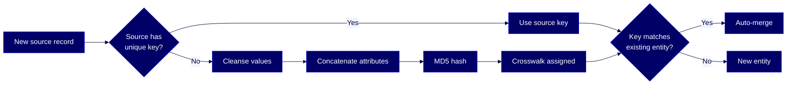

# HOWTO: Configure surrogate keys

Generate stable crosswalk keys for source systems that don't supply their own — so identical entities like shared addresses match and merge correctly.



## Overview

When a source system doesn't supply a unique key for an entity — common for addresses, locations, or flat-file extracts — Reltio can calculate a deterministic surrogate key from the cleansed attribute values. Identical inputs produce identical surrogate keys, which makes duplicate detection and auto-merge work without relying on the source.

This guide is for these Reltio roles: **Reltio Configurator**, **Developer**. For more information on data unification roles in the Reltio Context Intelligence Platform, see [About roles](https://docs.reltio.com/en/roles/about-roles).

## Contents

1. [Getting started](#1-getting-started)
2. [Key concepts](#2-key-concepts)
3. [Decide when to use a surrogate key](#3-decide-when-to-use-a-surrogate-key)
4. [Configure the surrogate crosswalk in L3](#4-configure-the-surrogate-crosswalk-in-l3)
5. [Trigger surrogate key generation on ingest](#5-trigger-surrogate-key-generation-on-ingest)
6. [Control generation with the enforce flag](#6-control-generation-with-the-enforce-flag)
7. [Handle missing values with generationLogic](#7-handle-missing-values-with-generationlogic)
8. [Recalculate surrogate keys for existing data](#8-recalculate-surrogate-keys-for-existing-data)
9. [Troubleshooting](#9-troubleshooting)
10. [Further reading](#10-further-reading)
11. [Glossary](#11-glossary)

## 1. Getting started

Gather these before you begin:

- A Reltio tenant with access to the Configuration API
- An L3 configuration you can edit
- Identified source systems that don't provide keys for one or more entity types
- Decisions about which attributes uniquely identify those entities

## 2. Key concepts

These terms appear throughout the guide.

- **[Surrogate key](#glossary)** — a crosswalk key calculated by Reltio from cleansed attribute values when the source system doesn't provide one.
- **[Crosswalk](#glossary)** — a pointer from a Reltio entity back to a record in a source system.
- **[refEntity](#glossary)** — in an incoming JSON payload, the crosswalk for a referenced entity (for example, a `[Location](#glossary)` linked to an `HCP`).
- **[refRelation](#glossary)** — in an incoming JSON payload, the crosswalk for the relationship that links one entity to another (for example, `hasAddress`).
- **[Enforce flag](#glossary)** — a `surrogateCrosswalks` configuration option that controls whether a surrogate is always generated or only as a fallback.
- **[generationLogic](#glossary)** — a parameter that controls how surrogate keys handle missing operational values (OV).

> **Learn more:** [Configuring surrogate keys](https://docs.reltio.com/en/objectives/model-data/data-modeling-at-a-glance/data-modeling-operation/define-crosswalks-for-data-sources/configuring-surrogate-keys) in the Reltio documentation.

## 3. Decide when to use a surrogate key

Not every source needs surrogate keys. Use this table as a first filter.

| Situation | What to use |
|---|---|
| Source provides a unique key per record | Use the source's own keys — no surrogate needed |
| Source has a key for the parent but not for nested objects (e.g., [HCP](#glossary) has an ID, inline addresses don't) | Configure a surrogate for the nested entity |
| Source is a flat file with no keys | Configure surrogate keys from the attribute values |
| Source de-normalizes — the same address repeats across many rows | Configure surrogate keys so duplicates merge automatically |

### Methodology by source pattern

Reltio's documentation lists four patterns for how source data arrives and the recommended key methodology for each.

| Pattern | Methodology |
|---|---|
| **Pattern 1** — Each HCP comes with a single address on the same row | Use the unique key of the HCP as the `[refRelation](#glossary)` key |
| **Pattern 2** — Each HCP has multiple addresses in one flat file, each row a different address | Construct a key from HCP key + address — e.g., `101876\|123MainStreet\|Anytown\|91301\|USA` |
| **Pattern 3** — HCPs in one file, addresses in a separate file with the HCP key as foreign key; `AddrKey` is unique | Use the source's `AddrKey` as the `refRelation` key |
| **Pattern 4** — Many-to-many via an intersection table with unique keys | Use the intersection-table key as the `refRelation` key |

### Why this matters

Reltio models address as a `Party` object in L1 plus a `Location` object linked by `hasAddress`. `Location` is the address attribute of anything that inherits from `Party` — `Individual`, `Organization`, `HCP`, `[HCO](#glossary)`. If a source repeats the same address across many records, surrogate keys let Reltio merge them into a single `Location` entity automatically. The merged entity ends up with relationships to every entity that shares the address.

> **Learn more:** [Configuring surrogate keys](https://docs.reltio.com/en/objectives/model-data/data-modeling-at-a-glance/data-modeling-operation/define-crosswalks-for-data-sources/configuring-surrogate-keys) in the Reltio documentation.

## 4. Configure the surrogate crosswalk in L3

Add a `surrogateCrosswalks` block to the entity type in your L3 configuration. The block specifies the source and the ordered list of attributes Reltio will hash to produce the key.

The example below configures a `Location` surrogate keyed off the full address for the `HCPMaster` source.

```json
{
  "uri": "configuration",
  "label": "Layer3Configuration",
  "description": "simple-l3.v1",
  "schemaVersion": "1",
  "referenceConfigurationURI": "configuration/_vertical/life-sciences",
  "abstract": "false",
  "entityTypes": [{
    "uri": "configuration/entityTypes/Location",
    "surrogateCrosswalks": [{
      "source": "configuration/sources/HCPMaster",
      "enforce": "true",
      "attributes": [
        "configuration/entityTypes/Location/attributes/AddressLine1",
        "configuration/entityTypes/Location/attributes/AddressLine2",
        "configuration/entityTypes/Location/attributes/City",
        "configuration/entityTypes/Location/attributes/StateProvince",
        "configuration/entityTypes/Location/attributes/Country",
        "configuration/entityTypes/Location/attributes/Street",
        "configuration/entityTypes/Location/attributes/SubBuilding",
        "configuration/entityTypes/Location/attributes/Zip/attributes/Zip5",
        "configuration/entityTypes/Location/attributes/Zip/attributes/Zip4"
      ]
    }]
  }]
}
```

### Key rules

- **The attribute list order matters** — the hash is calculated from concatenated, cleansed values in this order. Two source systems keyed off different orderings produce different surrogate keys for the same logical address.
- **Apply per source** — each source that needs surrogate keys needs its own entry in `surrogateCrosswalks`.
- **Cleansed values, not raw** — Reltio uses cleansed, standardized values to calculate the hash. That's what makes `New York, Main Avenue 123` and `New York, Main Ave 123` produce the same key after cleansing.

## 5. Trigger surrogate key generation on ingest

Once the L3 config is in place, trigger surrogate generation per record by setting `[refEntity](#glossary).crosswalks[0].value` to `"Surrogate"` in the incoming JSON.

```json
[
  {
    "type": "configuration/entityTypes/HCP",
    "attributes": {
      "FirstName": [{"value": "FirstName001"}],
      "Address": [
        {
          "value": {
            "AddressLine1": [{"value": "AddressA"}],
            "City": [{"value": "CityA"}],
            "Street": [{"value": "StreetA"}]
          },
          "refEntity": {
            "crosswalks": [
              {"type": "configuration/sources/FB", "value": "Surrogate"}
            ]
          },
          "refRelation": {
            "crosswalks": [
              {"type": "configuration/sources/FB", "value": "rel_001"}
            ]
          }
        }
      ]
    },
    "crosswalks": [
      {"type": "configuration/sources/FB", "value": "hcp_001"}
    ]
  }
]
```

### What happens

- `refEntity.value: "Surrogate"` tells Reltio to compute the `Location`'s crosswalk key from the configured attributes.
- `refRelation` provides a separate key for the `hasAddress` relationship, which links the `HCP` to the `Location`.
- The surrogate is scoped to the source defined in `configuration/sources/FB`.

### Why two keys

When primary entities like `HCP` or `HCO` have addresses associated with them, two crosswalk keys matter:

- **refEntity** — the `Location` object being loaded.
- **refRelation** — the `hasAddress` relationship used to link one entity to another.

> **Learn more:** [Configuring surrogate keys](https://docs.reltio.com/en/objectives/model-data/data-modeling-at-a-glance/data-modeling-operation/define-crosswalks-for-data-sources/configuring-surrogate-keys) in the Reltio documentation.

## 6. Control generation with the enforce flag

The `enforce` flag on a surrogate crosswalk config determines whether a surrogate is always generated or only as a fallback.

| `enforce` value | Behavior |
|---|---|
| `true` | A surrogate is **always** generated, even if the incoming record includes a crosswalk value |
| `false` | A surrogate is generated **only** when the incoming `crosswalks` value is empty. If the record provides a value, that value is used and no surrogate is generated |

### Example with `enforce: false`

Record 1 has an empty crosswalk value — a surrogate is generated:

```json
{"crosswalks": [{"type": "configuration/sources/Veeva", "value": ""}]}
```

Record 2 has a crosswalk value — no surrogate is generated:

```json
{"crosswalks": [{"type": "configuration/sources/Veeva", "value": "I1"}]}
```

### Example with `enforce: true`

If two entity payloads have identical attribute values but different crosswalks, and `enforce` is `true`, the resulting entity ends up with **three crosswalk values** — the two supplied plus the surrogate.

## 7. Handle missing values with generationLogic

Not every record comes with every attribute populated. The `generationLogic` parameter controls what Reltio does when an attribute used in the surrogate key construction is missing operational values (OV).

| `generationLogic` value | Behavior when an attribute lacks OV |
|---|---|
| `ovOnly` (default) | A null is used for the missing attribute when calculating the MD5 hash |
| `useFirstNonOvWhenOvMissing` | Use the first non-OV value; if none, use null |
| `generateUidWhenOvMissing` | Generate a random UUID instead of the concatenated hash |
| `generateUidWhenOvAndNonOvMissing` | Generate a UUID only if both OV and non-OV are missing |
| `generateUidWhenAllOvMissing` | Generate a UUID only if **all** attributes lack OV |

### Worked example

A configuration has three attributes: `AddressLine1` (non-OV value `TestAddressLine1`), `City` (OV value `Chel`), and `Country` (OV value `USA`).

| `generationLogic` | Resulting surrogate value |
|---|---|
| `ovOnly` | md5 hash of `nullnullchelnullusanullnullnull` |
| `useFirstNonOvWhenOvMissing` | md5 hash of `testaddressline1nullchelnullusanullnullnull` |
| `generateUidWhenOvMissing` | Random UUID |
| `generateUidWhenOvAndNonOvMissing` | Random UUID |
| `generateUidWhenAllOvMissing` | Random UUID |

> **Note:** Even if a specific crosswalk doesn't provide OVs for attributes used in surrogate key construction, Reltio calculates the surrogate using the OV values available at the entity level.

> **Important:** If lookup values are included in the surrogate calculation and a lookup is unresolved, a random value may be used depending on `generationLogic`. That produces different crosswalk values for the same entity with the same values. Resolve all lookup issues before calculating surrogate crosswalks.

> **Learn more:** [Configuring surrogate keys](https://docs.reltio.com/en/objectives/model-data/data-modeling-at-a-glance/data-modeling-operation/define-crosswalks-for-data-sources/configuring-surrogate-keys) in the Reltio documentation.

## 8. Recalculate surrogate keys for existing data

The `surrogateCrosswalks` config applies to new ingests. Existing entities in your tenant keep their current keys until you recalculate.

To apply a new or changed surrogate key configuration to existing data, run the `recalculatesurrogatecrosswalks` task.

Run it when:

- You just changed a `surrogateCrosswalks` configuration in L3
- You added a new surrogate key to an entity type that already has data
- You're onboarding an existing tenant to surrogate keys for the first time

> **Learn more:** [Recalculate surrogate crosswalks task](https://docs.reltio.com/en/developer-resources/entity-management-apis/entity-management-apis-at-a-glance/entities-api/update-entities/recalculate-surrogate-crosswalks) in the Reltio documentation.

## 9. Troubleshooting

Common symptoms and where to look.

| Symptom | Cause | Fix |
|---|---|---|
| Identical addresses don't merge into one `Location` | Surrogate not configured for that source, or attribute list differs across sources | Verify the `surrogateCrosswalks` entry for the source and check that the attribute list matches other sources |
| Same entity loaded twice produces different surrogate keys | Unresolved lookup values with a `generateUid*` generationLogic | Resolve lookups before ingest, or switch to a deterministic generationLogic |
| Surrogate isn't generated even though no key was provided | `enforce: false` with a `crosswalks` array that has a non-empty value | Send an empty `value` string, or set `enforce: true` |
| Surrogate crosswalks on existing entities didn't update after a config change | Configuration changes only affect new data | Run the `recalculatesurrogatecrosswalks` task |
| Address cleansing doesn't produce the expected hash | Cleansing rules not applied, or a different cleanser is active on a different source | Confirm cleansing runs for the source; confirm that attribute order in `surrogateCrosswalks` matches what's passed |

## 10. Further reading

- [Configuring surrogate keys](https://docs.reltio.com/en/objectives/model-data/data-modeling-at-a-glance/data-modeling-operation/define-crosswalks-for-data-sources/configuring-surrogate-keys)
- [Recalculate surrogate crosswalks task](https://docs.reltio.com/en/developer-resources/entity-management-apis/entity-management-apis-at-a-glance/entities-api/update-entities/recalculate-surrogate-crosswalks)
- [Define crosswalks for data sources](https://docs.reltio.com/en/objectives/model-data/data-modeling-at-a-glance/data-modeling-operation/define-crosswalks-for-data-sources)

## 11. Glossary

**Crosswalk:** A pointer from a Reltio entity back to the source-system record it came from. Every entity in Reltio has at least one crosswalk.

**Enforce flag:** A boolean on a `surrogateCrosswalks` config entry. `true` means always generate a surrogate; `false` means only generate one when no crosswalk value is supplied.

**generationLogic:** A parameter that controls how surrogate keys handle missing operational values. Accepts `ovOnly`, `useFirstNonOvWhenOvMissing`, `generateUidWhenOvMissing`, `generateUidWhenOvAndNonOvMissing`, and `generateUidWhenAllOvMissing`.

**HCO:** Health Care Organization — a Life Sciences entity type.

**HCP:** Healthcare Professional — a Life Sciences entity type.

**Location:** The Reltio entity type used for addresses. Inherits from `Party` via `hasAddress`.

**Operational value (OV):** The winning value for an attribute, chosen by survivorship rules when multiple crosswalks contribute values.

**refEntity:** In an incoming JSON payload, the crosswalk for a referenced entity — for example, a `Location` linked to an `HCP`.

**refRelation:** In an incoming JSON payload, the crosswalk for the relationship that links one entity to another — for example, `hasAddress`.

**Surrogate crosswalk:** A crosswalk whose key is calculated by Reltio from cleansed attribute values rather than supplied by the source system.

**Surrogate key:** The key value of a surrogate crosswalk — typically an MD5 hash of the concatenated, cleansed attribute values.

---

> **Disclaimer:** AI-generated from the Reltio documentation snapshot 2026-04-22 02:14 UTC (3,233 topics). AI output can contain subtle inaccuracies, and the knowledge base syncs twice a week — so the content here may lag [docs.reltio.com](https://docs.reltio.com). Verify anything critical against the official docs and your own tenant. Full disclaimer: [DISCLAIMER.md](../DISCLAIMER.md).
