# HOWTO: Set Up the Reltio Integration for Veeva Vault CRM

A step-by-step guide to preparing, deploying, and configuring bidirectional synchronization between Reltio and Veeva Vault CRM using the Reltio Integration Hub (RIH) — covering HCP, HCO, location, and relationship data across real-time and batch flows.

```mermaid
%%{init: {'theme': 'base', 'themeVariables': {'primaryColor': '#000066', 'primaryTextColor': '#ffffff', 'primaryBorderColor': '#0000CC', 'lineColor': '#000033', 'textColor': '#000033', 'secondaryColor': '#f5f5f5', 'tertiaryColor': '#f0f4ff', 'edgeLabelBackground': '#f0f4ff', 'clusterBkg': '#f0f4ff', 'clusterBorder': '#0000CC'}, 'themeCSS': '.edgeLabel { color: #000033 !important; background-color: #f0f4ff !important; font-weight: 500 !important; } .edgeLabel rect, .edgeLabel foreignObject { fill: #f0f4ff !important; }', 'flowchart': {'nodeSpacing': 40, 'rankSpacing': 55, 'curve': 'basis', 'padding': 12}}}%%
flowchart LR
    A[Start] --> B[Prerequisites]
    B --> B1[Reltio tenant]
    B --> B2[Veeva Vault CRM]
    B --> B3[Event queue]
    B1 --> C[Deploy recipes]
    B2 --> C
    B3 --> C
    C --> D[Configure connections]
    D --> E[Set project properties]
    E --> F[Configure event queue streaming]
    F --> G[Choose sync mode]
    G -- Real-time --> H[Activate RT recipes]
    G -- Batch --> I[Schedule batch jobs]
    H --> J[Done]
    I --> J
```



## Overview

The Reltio Integration for Veeva Vault CRM uses Reltio Integration Hub recipes to keep [HCP](#glossary) and [HCO](#glossary) master records in sync bidirectionally between Reltio and Veeva Vault CRM. This guide covers the complete setup: deploying the recipe package, configuring connections and project properties, setting up event queue streaming, and activating the recipes for your chosen sync mode.

This guide is for these Reltio roles: **Reltio Configurator**, **System Administrator**. For more information on data unification roles in the Reltio Context Intelligence Platform, see [About roles](https://docs.reltio.com/en/roles/about-roles?utm_source=ai-corpus&utm_medium=markdown&utm_campaign=reltio-ai-ready-docs).

## Contents

1. [Getting started](#1-getting-started)
2. [Key concepts](#2-key-concepts)
3. [Deploy the integration recipes](#3-deploy-the-integration-recipes)
4. [Configure connections](#4-configure-connections)
5. [Set project properties](#5-set-project-properties)
6. [Configure event queue streaming](#6-configure-event-queue-streaming)
7. [Choose a synchronization mode](#7-choose-a-synchronization-mode)
8. [Activate and test recipes](#8-activate-and-test-recipes)
9. [Customize attribute mappings](#9-customize-attribute-mappings)
10. [Troubleshooting](#10-troubleshooting)
11. [Further reading](#11-further-reading)
12. [Glossary](#12-glossary)

## 1. Getting started

Before you begin, confirm you have access to the following systems and credentials:

| System | What you need |
|--------|--------------|
| Reltio | A tenant with the [Life Sciences velocity pack](#glossary) deployed, RIH enabled, and a user assigned `ROLE_INTEGRATION_SPECIALIST` or `ROLE_INTEGRATION_CUSTOMER_ADMIN` |
| Veeva Vault CRM | A licensed tenant with an API-enabled user, DNS (for example, `yourvault.veevavault.com`), username, and password |
| Event queue (real-time only) | AWS SQS, Azure Service Bus Topic, or GCP Pub/Sub credentials — see [section 6](#6-configure-event-queue-streaming) for details |
| RIH | Access to the Reltio Integration Hub Console with admin credentials |
| Recipe package | The latest Reltio–Veeva Vault CRM ZIP package (contact your Reltio Customer Success Manager) |

> **Important:** Veeva Vault CRM currently uses username and password for authentication. OAuth and client credentials are not supported.

> **Note:** Batch integrations don't require event queue setup. If you only plan to use scheduled batch sync, you can skip the queue prerequisites.

> **Learn more:** [Prepare your environment for Reltio–Veeva Vault CRM integration](https://docs.reltio.com/en/applications/data-integrations/application-integration-at-a-glance/introduction-to-the-reltio-integration-for-veeva-vault-crm/prepare-your-environment-for-reltioveeva-vault-crm-integration?utm_source=ai-corpus&utm_medium=markdown&utm_campaign=reltio-ai-ready-docs)

## 2. Key concepts

Before diving into setup, familiarize yourself with the core terms and architecture used in this integration:

- **[RIH](#glossary)** — Reltio Integration Hub, the low-code platform that hosts and executes prebuilt integration recipes
- **[HCP](#glossary)** — Healthcare Professional, an entity type representing individual healthcare providers (doctors, nurses, pharmacists)
- **[HCO](#glossary)** — Healthcare Organization, an entity type representing institutions (hospitals, clinics, group practices)
- **[DCR](#glossary)** — Data Change Request, a workflow where changes from Veeva Vault CRM are submitted to Reltio for approval before updating master records
- **[Crosswalk](#glossary)** — a pointer on a Reltio entity that tracks the corresponding Veeva Vault record ID, enabling bidirectional lookup
- **[Recipe](#glossary)** — a preconfigured integration workflow in RIH that handles a specific synchronization task (for example, upsert HCP in Vault CRM)

### How data flows between systems

The integration uses event queues and the Veeva Vault CRM connector to move data in both directions.

**Reltio to Veeva Vault CRM:**

1. A change event (create, update, merge, delete) is emitted to the configured queue (SQS, Pub/Sub, or Azure Topic).
2. A trigger recipe detects the message and initiates the appropriate processing flow.
3. The process recipe transforms the payload using mapping logic and pushes the record to Vault CRM via the connector.
4. A callback updates the Reltio crosswalk with the Vault record ID.

**Veeva Vault CRM to Reltio:**

1. A batch or event recipe retrieves changes from Vault CRM using the Veeva Direct Data API (incremental files generated every 15 minutes).
2. The process recipe transforms the record and sends it to Reltio.
3. If DCR mode is enabled, a data change request is raised in Reltio for approval before updating master records.

### Supported data domains

The integration handles these data types out of the box:

| Data domain | Description |
|------------|-------------|
| HCP | Demographic, credential, license, and identifier fields for healthcare professionals |
| HCO | Institution type, address, contact, and hierarchy data for healthcare organizations |
| Location | Address-level data linked to HCPs or HCOs via reference attributes |
| Relationships | HCP-HCO affiliations, HCO-HCO hierarchies, and crosswalks |
| Identifiers | External IDs and system-specific keys for entity mapping |
| Reference data | Dropdown and lookup values (through RDM) used in Veeva Vault CRM |

> **Learn more:** [Introduction to the Reltio Integration for Veeva Vault CRM](https://docs.reltio.com/en/applications/data-integrations/application-integration-at-a-glance/introduction-to-the-reltio-integration-for-veeva-vault-crm?utm_source=ai-corpus&utm_medium=markdown&utm_campaign=reltio-ai-ready-docs)

## 3. Deploy the integration recipes

The recipe package contains all prebuilt recipes for the Veeva Vault CRM integration. Import it into a new RIH project.

### Create a new project

1. Sign in to the RIH Console.
2. In the **Projects** tab, select the **+** icon.
3. Name the project (for example, `Veeva Vault Integration`) and select **Create**.

### Import the recipe package

1. Navigate to the new project.
2. Go to **Tools** > **Recipe Lifecycle Management (RLCM)**.
3. Select the **Import** tab.
4. Choose **Import package to a new folder**.
5. Upload the ZIP file provided by Reltio.
6. Select the project folder as the target location.
7. Confirm all recipes and assets imported successfully.

### Verify the folder structure

After import, the project should contain these folders:

| Folder | Purpose |
|--------|---------|
| `RIH \| Trigger Veeva to Reltio` | Inbound trigger recipes (Veeva to Reltio) |
| `RIH \| Trigger Reltio to Veeva` | Outbound trigger recipes (Reltio to Veeva) |
| `PROC \| Reltio to Veeva` | Process recipes for outbound sync |
| `PROC \| Raise DCR in Reltio` | DCR handling recipes |
| `PROC \| Error Handler` | Error handling and notification recipes |
| `_Connections` | Connection configurations |
| `Lookup` | Attribute and object mapping tables |

> **Learn more:** [Deploy and configure the Veeva Vault CRM integration recipes](https://docs.reltio.com/en/applications/data-integrations/application-integration-at-a-glance/introduction-to-the-reltio-integration-for-veeva-vault-crm/deploy-and-configure-the-veeva-vault-crm-integration-recipes?utm_source=ai-corpus&utm_medium=markdown&utm_campaign=reltio-ai-ready-docs)

## 4. Configure connections

Set up the connections that RIH recipes use to communicate with Reltio, Veeva Vault CRM, and the event queue.

### Reltio platform connection

1. In the project, open the **_Connections** folder.
2. Select `Veeva | CON | Reltio Platform Connection`.
3. Enter the Environment URL, Tenant ID, and credentials for the Reltio API user.
4. Select **Connect** and confirm the status shows **Successful**.

### Veeva Vault CRM connection

1. Select `Veeva | CON | Veeva Vault CRM Connection`.
2. Enter the Vault DNS (for example, `yourvault.veevavault.com`), username, and password.
3. Select **Connect** and confirm the status shows **Successful**.

### Event queue connection (real-time only)

Configure the connection for your cloud provider. Choose one based on your infrastructure.

**AWS SQS:**

1. Select `Veeva | CON | AWS SQS Connection`.
2. Enter the Access Key ID, Secret Access Key, Region, and Queue ARN.
3. Select **Connect**.

**Azure Service Bus:**

1. Select `Veeva | CON | Azure Service Bus Connection`.
2. Enter the Namespace name, Topic name, and Connection string (with `Send` and `Listen` permissions).
3. Select **Connect**.

**GCP Pub/Sub:**

1. Select `Veeva | CON | GCP Topic Connection`.
2. Upload the service account JSON key file.
3. Enter the Project ID, Topic name, and Subscription name.
4. Select **Connect**.

> **Tip:** Test each connection immediately after configuring it. A green **Successful** status confirms RIH can reach the external system.

> **Learn more:** [Configure connections](https://docs.reltio.com/en/applications/data-integrations/application-integration-at-a-glance/introduction-to-the-reltio-integration-for-veeva-vault-crm/deploy-and-configure-the-veeva-vault-crm-integration-recipes?utm_source=ai-corpus&utm_medium=markdown&utm_campaign=reltio-ai-ready-docs)

## 5. Set project properties

Project properties are environment-specific settings that control recipe behavior. Set them before activating any recipes.

1. In the project, go to **Settings** > **Project Properties**.
2. Enter the required values.

### Required properties

| Property | Description | Example |
|----------|-------------|---------|
| `Reltio tenant ID` | Unique tenant identifier | `XXXXXgsNwcq7XXX` |
| `Reltio environment URL` | Base URL of your Reltio environment | `https://dev.reltio.com/` |
| `RIH service user` | Username for the RIH API/service account. Prevents infinite sync loops by filtering events generated by RIH itself. | `VEEVA_INTEGRATION_PROCESS_DEV` |
| `Veeva service user ID` | Veeva user ID for authentication | `12345678` |
| `Veeva source type` | Source type identifier for Veeva | `Veeva` |
| `HCP - Entity name` | Name of the HCP entity type in your Reltio model | `HCP` |
| `HCO - Entity name` | Name of the HCO entity type in your Reltio model | `HCO` |
| `HCP - HCO relation name` | Relation type name between HCPs and HCOs | `HCPisAffiliatedWithHCO` |
| `HCO - HCO relation name` | Relation type name between healthcare organizations | `OrganizationHierarchy` |
| `Address - Reference attribute name` | Reference attribute in Reltio for the address | `Address` |
| `Raise DCR in Reltio` | Whether to raise data change requests in Reltio for Veeva-originated changes | `No` |
| `AWS Micro Batch Size` | Records processed per AWS batch (max 150) | `150` |

### Optional properties

| Property | Description | Example |
|----------|-------------|---------|
| `Email for RIH Job Notifications` | Email for RIH job notifications | `abc@xyz.com` |
| `Email for Reltio Exports Notifications` | Email for Reltio export job notifications | `abc@xyz.com` |
| `HCP - Reltio export filter condition` | Filter condition for HCP export from Reltio | `equals(id,'6t1dB9m')` |
| `HCO - Reltio export filter condition` | Filter condition for HCO export from Reltio | `equals(id,'6t1dB9m')` |
| `VQL export filter` | VQL filter for selecting records to export from Vault CRM | `modified_date__v > '2025-10-23T14:24:00.000Z'` |

3. Save changes.

> **Important:** The `RIH service user` must be used exclusively by RIH. Using the same credentials for other processes causes infinite event loops.

> **Learn more:** [Reference: Integration project properties and values](https://docs.reltio.com/en/applications/data-integrations/application-integration-at-a-glance/introduction-to-the-reltio-integration-for-veeva-vault-crm/reference-integration-project-properties-and-values?utm_source=ai-corpus&utm_medium=markdown&utm_campaign=reltio-ai-ready-docs)

## 6. Configure event queue streaming

For real-time synchronization, configure your Reltio tenant to publish entity and relationship change events to an external queue. Skip this section if you only plan to use batch sync.

### Set up the external queue in Reltio

1. In the Reltio Console, select **Tenant Management**.
2. In the left navigation, select **External Queues**.
3. Select **+Add Configuration**.
4. Enter the queue connection details:
   - **Provider:** Select your provider (Amazon SQS, Azure Topic, or GCP Pub/Sub)
   - Enter your credentials (access key/secret for AWS, connection string for Azure, service account key for GCP)
   - **Queue/Topic Name:** Enter the name (or select **Use ARN** for the full ARN)
   - **Region:** Enter the cloud region (AWS/Azure only)
   - **Format:** Select **JSON**

### Set the object filter

The object filter controls which entity and relationship types trigger events. Use one of these options.

**Default filter** (sends all HCP, HCO, and relationship events):

```
(equals(type,'configuration/entityTypes/HCP') or equals(type,'configuration/entityTypes/HCO') or equals(type,'configuration/relationTypes/HCPHasAddress') or equals(type,'configuration/relationTypes/HCOHasAddress') or equals(type,'configuration/relationTypes/HCPisAffiliatedWithHCO') or equals(type,'configuration/relationTypes/OrganizationHierarchy'))
```

**Delta filter** (recommended for production — sends events only when mapped fields change):

> **Note:** The delta filter is significantly longer and specific to your data model. It checks for changes in individual attributes like `Name`, `Phone.Number`, `Email.Email`, `Address.AddressLine1`, and so on. See the official documentation for the complete filter expression tailored to your model.

### Set the type filter

Select these event types:

- `ENTITY_CREATED`
- `ENTITY_CHANGED`
- `ENTITY_REMOVED`
- `ENTITY_LOST_MERGE`
- `RELATIONSHIP_CREATED`
- `RELATIONSHIP_CHANGED`
- `RELATIONSHIP_REMOVED`

### Set the payload configuration

| Filter type | Payload type | Fields to include |
|------------|-------------|-------------------|
| Default | Snapshot - Selected fields | `attributes`, `crosswalks`, `endObject`, `startObject`, `updatedBy`, `createdBy`, `type`, `uri` |
| Delta | Snapshot with delta | Same as above, plus `delta.attributes.*` fields |

5. Select the **Transmit OV only** checkbox to include only operational values.
6. Select the **Enable Streaming** checkbox.
7. Select **Save**.

> **Important:** If using the delta filter with relationship events, add the `RelationEventsFilteringFields` array to your tenant's physical configuration under the `streamingConfig` section. This array must include: `updatedTime`, `startRefPinned`, `updatedBy`, `type`, `uri`, `crosswalks`, `endObject`, `startObject`, `createdBy`, `endRefPinned`, `analyticsAttributes`, `createdTime`, `attributes`, `endRefIgnored`, `startRefIgnored`.

### Verify streaming

1. Confirm the configuration appears in the External Queues tab with status **Active**.
2. Update a test entity in Reltio and confirm a message appears in the queue.
3. Check the RIH recipe logs to confirm the event was processed.

> **Learn more:** [Configure event queues (SQS, Pub/Sub, or Azure)](https://docs.reltio.com/en/applications/data-integrations/application-integration-at-a-glance/introduction-to-the-reltio-integration-for-veeva-vault-crm/configure-event-queues-sqs-pubsub-or-azure?utm_source=ai-corpus&utm_medium=markdown&utm_campaign=reltio-ai-ready-docs)

## 7. Choose a synchronization mode

RIH supports three synchronization modes for the Veeva Vault CRM integration. Choose the one that matches your volume and latency requirements:

| Mode | Trigger | Latency | Best for |
|------|---------|---------|----------|
| Real-time (Reltio to Veeva) | Event-driven via queue | Sub-minute | Operational sync, field-level changes by data stewards |
| Near real-time (Veeva to Reltio) | Scheduled poll via Direct Data API | Up to 15 minutes | Vault-originated changes to HCP, HCO, affiliations |
| Batch (bidirectional) | Scheduled (daily/weekly) | Minutes to hours | Initial loads, hierarchy sync, large-volume migrations |

You can combine modes — for example, use real-time for Reltio-to-Veeva and batch for periodic bulk loads from Veeva to Reltio.

> **Note:** Real-time mode is not recommended for high-volume changes such as initial migrations, batch updates, or reindex tasks.

> **Learn more:** [Real-time and batch integration flows](https://docs.reltio.com/en/applications/data-integrations/application-integration-at-a-glance/introduction-to-the-reltio-integration-for-veeva-vault-crm/real-time-and-batch-integration-flows?utm_source=ai-corpus&utm_medium=markdown&utm_campaign=reltio-ai-ready-docs)

## 8. Activate and test recipes

After configuring connections, properties, and event streaming, activate the recipes for your chosen sync mode.

### Activate core recipes

Review the imported recipes and activate the ones that match your sync mode.

For real-time (Reltio to Veeva):

1. Activate the trigger recipe: `Vault CRM | TRG | Real-time Trigger Recipe`.
2. Activate the process recipes:
   - `Vault CRM | PROC | Upsert HCP Account in Vault CRM`
   - `Vault CRM | PROC | Upsert HCO Account in Vault CRM`
3. Activate the error handler recipe.

For near real-time (Veeva to Reltio):

1. Activate the trigger recipe that polls the Vault Direct Data API.
2. Activate the corresponding process recipes for HCP and HCO ingest.
3. If DCR mode is enabled (`Raise DCR in Reltio` = `Yes`), activate the DCR processing recipes.

### Run a test

1. Update a sample HCP or HCO record in Reltio.
2. Monitor the RIH job log for a successful recipe run.
3. Confirm the change appears in Veeva Vault CRM.
4. Check the Reltio entity for a crosswalk pointing to the Vault record ID.
5. Reverse the test: update a record in Veeva Vault CRM and confirm it syncs to Reltio.

### Validation checklist

Confirm these items before going live:

- All connections show **Successful** status
- Recipe job logs show successful executions
- Crosswalks are created correctly in both Reltio and Veeva
- Event queue is receiving and processing messages (real-time mode)
- DCR workflow triggers correctly (if enabled)

> **Learn more:** [Deploy and configure the Veeva Vault CRM integration recipes](https://docs.reltio.com/en/applications/data-integrations/application-integration-at-a-glance/introduction-to-the-reltio-integration-for-veeva-vault-crm/deploy-and-configure-the-veeva-vault-crm-integration-recipes?utm_source=ai-corpus&utm_medium=markdown&utm_campaign=reltio-ai-ready-docs)

## 9. Customize attribute mappings

The integration includes default attribute mappings for HCP, HCO, location, and relationship data. You can customize these mappings using lookup tables in RIH.

### Available mapping tables

| Lookup table | What it maps |
|-------------|-------------|
| `Veeva Integration Mapping - HCP` | HCP attributes between Reltio and Vault CRM |
| `Veeva Integration Mapping - HCO` | HCO attributes between Reltio and Vault CRM |
| `Veeva Integration Mapping - Location` | Location/address fields between Reltio and Vault CRM |
| `Veeva Integration Mapping - Relationships` | HCP-HCO and HCO-HCO relationship attributes |

### Add a custom attribute mapping

Each mapping table uses these columns:

- **Reltio URI** — the attribute path in your Reltio model (for example, `.../HCO/attributes/Name`)
- **Veeva Object** — the target object in Vault CRM (for example, `account__v`)
- **Veeva Vault Field** — the destination field name (for example, `name__v`)

To add a new mapping:

1. Open the lookup table for the relevant entity type.
2. Add a new row.
3. Enter the Reltio attribute URI, the Veeva object, and the Veeva field.
4. Save the updated mapping table.
5. Confirm the recipes reference the updated table.
6. Test with a sample record to verify the mapping works.

### Default HCO mappings (sample)

These are some of the default HCO attribute mappings included in the integration:

| Reltio attribute | Veeva field | Notes |
|-----------------|-------------|-------|
| `HCO/attributes/Name` | `name__v` | Organization name |
| `HCO/attributes/CompanyType` | `type__v` | Organization type |
| `HCO/attributes/WebsiteURL` | `website_cda__v` | Website |
| `HCO/attributes/Email/attributes/Email` (Primary) | `email_cda__v` | Primary email |
| `HCO/attributes/Phone/attributes/Number` (Work Phone) | `office_phone_cda__v` | Office phone |
| `HCO/attributes/Phone/attributes/Number` (Fax) | `fax_cda__v` | Fax number |
| `HCO/attributes/Identifiers/attributes/ID` (NPI) | `npi__v` | National Provider Identifier |
| `HCO/attributes/Identifiers/attributes/ID` (Veeva Network) | `veeva_network_id__v` | Veeva Network ID |

> **Note:** The documentation does not include a separate HCP attribute mapping reference table. Refer to the RIH lookup table `Veeva Integration Mapping - HCP` for the full list of HCP mappings in your environment.

> **Learn more:** [Map and customize HCP, HCO, and relationship types](https://docs.reltio.com/en/applications/data-integrations/application-integration-at-a-glance/introduction-to-the-reltio-integration-for-veeva-vault-crm/map-and-customize-hcp-hco-and-relationship-types?utm_source=ai-corpus&utm_medium=markdown&utm_campaign=reltio-ai-ready-docs)

## 10. Troubleshooting

| Issue | Cause | Resolution |
|-------|-------|-----------|
| Connection test fails for Veeva Vault CRM | Invalid credentials, DNS, or network access | Verify the Vault DNS, username, and password. Confirm the API user has the required permissions. Check network/firewall rules. |
| Events not appearing in queue | Streaming not enabled or filter misconfigured | In Reltio Console > Tenant Management > External Queues, confirm the configuration status is **Active** and the object/type filters match your entity types. |
| Recipe triggers but no record created in Veeva | Mapping error or missing required field | Check the RIH job log for error details. Verify the lookup table mappings include all required Veeva fields. |
| Infinite sync loop | Same user credentials used for RIH and manual operations | Ensure `RIH service user` and `Veeva service user ID` properties are set to dedicated service accounts used exclusively by RIH. |
| DCR not raised in Reltio | DCR mode not enabled | Set `Raise DCR in Reltio` to `Yes` in project properties and activate the DCR processing recipes. |
| Duplicate records in Veeva Vault CRM | Crosswalk not established before second sync | Confirm the callback recipe is active so crosswalks are created after the first successful sync. Check for race conditions in high-volume scenarios. |
| Delta filter not working | `RelationEventsFilteringFields` not configured | Add the required field array to the tenant's physical configuration under `streamingConfig`. |
| Vault connector returns authentication error | Password expired or API user disabled | Reset the Vault CRM password and update the connection in RIH. Confirm the API user is still active in Vault CRM. |

## 11. Further reading

- [Introduction to the Reltio Integration for Veeva Vault CRM](https://docs.reltio.com/en/applications/data-integrations/application-integration-at-a-glance/introduction-to-the-reltio-integration-for-veeva-vault-crm?utm_source=ai-corpus&utm_medium=markdown&utm_campaign=reltio-ai-ready-docs) — overview, capabilities, and target audience
- [Use cases and supported data domains](https://docs.reltio.com/en/applications/data-integrations/application-integration-at-a-glance/introduction-to-the-reltio-integration-for-veeva-vault-crm/use-cases-and-supported-data-domains?utm_source=ai-corpus&utm_medium=markdown&utm_campaign=reltio-ai-ready-docs) — HCP, HCO, location, relationships, identifiers
- [Integration architecture and components](https://docs.reltio.com/en/applications/data-integrations/application-integration-at-a-glance/introduction-to-the-reltio-integration-for-veeva-vault-crm/integration-architecture-and-components?utm_source=ai-corpus&utm_medium=markdown&utm_campaign=reltio-ai-ready-docs) — data flow, connectors, project structure
- [Real-time and batch integration flows](https://docs.reltio.com/en/applications/data-integrations/application-integration-at-a-glance/introduction-to-the-reltio-integration-for-veeva-vault-crm/real-time-and-batch-integration-flows?utm_source=ai-corpus&utm_medium=markdown&utm_campaign=reltio-ai-ready-docs) — comparison of sync modes
- [DCR-based synchronization between Reltio and Veeva](https://docs.reltio.com/en/applications/data-integrations/application-integration-at-a-glance/introduction-to-the-reltio-integration-for-veeva-vault-crm/dcr-based-synchronization-between-reltio-and-veeva?utm_source=ai-corpus&utm_medium=markdown&utm_campaign=reltio-ai-ready-docs) — data change request workflows
- [Prepare your environment](https://docs.reltio.com/en/applications/data-integrations/application-integration-at-a-glance/introduction-to-the-reltio-integration-for-veeva-vault-crm/prepare-your-environment-for-reltioveeva-vault-crm-integration?utm_source=ai-corpus&utm_medium=markdown&utm_campaign=reltio-ai-ready-docs) — prerequisites and access requirements
- [Deploy and configure recipes](https://docs.reltio.com/en/applications/data-integrations/application-integration-at-a-glance/introduction-to-the-reltio-integration-for-veeva-vault-crm/deploy-and-configure-the-veeva-vault-crm-integration-recipes?utm_source=ai-corpus&utm_medium=markdown&utm_campaign=reltio-ai-ready-docs) — import, connections, properties, testing
- [Configure event queues (SQS, Pub/Sub, or Azure)](https://docs.reltio.com/en/applications/data-integrations/application-integration-at-a-glance/introduction-to-the-reltio-integration-for-veeva-vault-crm/configure-event-queues-sqs-pubsub-or-azure?utm_source=ai-corpus&utm_medium=markdown&utm_campaign=reltio-ai-ready-docs) — queue setup and streaming configuration
- [Map and customize HCP, HCO, and relationship types](https://docs.reltio.com/en/applications/data-integrations/application-integration-at-a-glance/introduction-to-the-reltio-integration-for-veeva-vault-crm/map-and-customize-hcp-hco-and-relationship-types?utm_source=ai-corpus&utm_medium=markdown&utm_campaign=reltio-ai-ready-docs) — lookup tables and custom attribute mapping
- [Enable delta handling for Reltio event streams](https://docs.reltio.com/en/applications/data-integrations/application-integration-at-a-glance/introduction-to-the-reltio-integration-for-veeva-vault-crm/enable-delta-handling-for-reltio-event-streams?utm_source=ai-corpus&utm_medium=markdown&utm_campaign=reltio-ai-ready-docs) — field-level change detection and sequencing
- [Reference: HCO attribute mapping](https://docs.reltio.com/en/applications/data-integrations/application-integration-at-a-glance/introduction-to-the-reltio-integration-for-veeva-vault-crm/reference-hco-attribute-mapping-reltio--veeva?utm_source=ai-corpus&utm_medium=markdown&utm_campaign=reltio-ai-ready-docs) — HCO field-by-field mapping table
- [Reference: Location/address mapping](https://docs.reltio.com/en/applications/data-integrations/application-integration-at-a-glance/introduction-to-the-reltio-integration-for-veeva-vault-crm/reference-locationaddress-mapping-for-veeva-account?utm_source=ai-corpus&utm_medium=markdown&utm_campaign=reltio-ai-ready-docs) — address field mapping
- [Reference: Relationship mapping and crosswalk logic](https://docs.reltio.com/en/applications/data-integrations/application-integration-at-a-glance/introduction-to-the-reltio-integration-for-veeva-vault-crm/reference-relationship-mapping-and-crosswalk-logic?utm_source=ai-corpus&utm_medium=markdown&utm_campaign=reltio-ai-ready-docs) — HCP-HCO, HCO-HCO, and crosswalk formats
- [Reference: Integration project properties and values](https://docs.reltio.com/en/applications/data-integrations/application-integration-at-a-glance/introduction-to-the-reltio-integration-for-veeva-vault-crm/reference-integration-project-properties-and-values?utm_source=ai-corpus&utm_medium=markdown&utm_campaign=reltio-ai-ready-docs) — all project properties with descriptions
- [FAQs on Reltio–Veeva Vault CRM integration](https://docs.reltio.com/en/applications/data-integrations/application-integration-at-a-glance/introduction-to-the-reltio-integration-for-veeva-vault-crm/faqs-on-reltioveeva-vault-crm-integration?utm_source=ai-corpus&utm_medium=markdown&utm_campaign=reltio-ai-ready-docs) — common questions and answers
- [Using multiple Veeva Vault connections in one integration](https://docs.reltio.com/en/applications/data-integrations/application-integration-at-a-glance/introduction-to-the-reltio-integration-for-veeva-vault-crm/using-multiple-veeva-vault-connections-in-one-integration?utm_source=ai-corpus&utm_medium=markdown&utm_campaign=reltio-ai-ready-docs) — multi-instance configuration
- [Recipe organization and execution flow](https://docs.reltio.com/en/applications/data-integrations/application-integration-at-a-glance/introduction-to-the-reltio-integration-for-veeva-vault-crm/recipe-organization-and-execution-flow?utm_source=ai-corpus&utm_medium=markdown&utm_campaign=reltio-ai-ready-docs) — folder structure and recipe types

## 12. Glossary

**Crosswalk:** A pointer on a Reltio entity that tracks the corresponding record in an external system. In this integration, crosswalks store Veeva Vault record IDs on Reltio entities and vice versa.

**DCR (Data Change Request):** A workflow where changes from Veeva Vault CRM are submitted to Reltio for approval before updating master records. Approved DCRs trigger sync back to Veeva; rejected DCRs require manual reconciliation.

**Direct Data API:** A Veeva Vault API that generates incremental data files at 15-minute intervals, used by RIH recipes to pull near real-time changes from Vault CRM.

**HCO (Healthcare Organization):** A Reltio entity type representing institutions such as hospitals, clinics, and group practices. Mapped to the `account__v` object in Veeva Vault CRM.

**HCP (Healthcare Professional):** A Reltio entity type representing individual healthcare providers such as doctors, nurses, and pharmacists. Mapped to the `account__v` object in Veeva Vault CRM.

**Life Sciences velocity pack:** A prebuilt Reltio data model that includes entity types for HCP, HCO, and Location, along with preconfigured relationships and attributes for life sciences use cases.

**Lookup table:** A configurable table in RIH that stores attribute mapping details between Reltio and Veeva Vault CRM, defining which Reltio fields map to which Vault CRM fields.

**Recipe:** A preconfigured integration workflow in Reltio Integration Hub that handles a specific synchronization task between Reltio and Veeva Vault CRM.

**RIH (Reltio Integration Hub):** The low-code platform within Reltio that hosts and orchestrates prebuilt integration recipes for connecting Reltio with external systems.

**ROLE_INTEGRATION_SPECIALIST:** A Reltio role that grants access to manage integration recipes and connections in the Integration Hub.

**Vault CRM Connector (SDK):** A Reltio-managed connector that handles authentication, API calls, and object-level transformations for the Veeva Vault CRM integration. The connector is not customizable.

---

> **Disclaimer:** AI-generated from the Reltio documentation snapshot 2026-04-28 02:14 UTC (3,237 topics). AI output can contain subtle inaccuracies, and the knowledge base syncs twice a week — so the content here may lag [docs.reltio.com](https://docs.reltio.com). Verify anything critical against the official docs and your own tenant. See the [full disclaimer](../DISCLAIMER.md).
