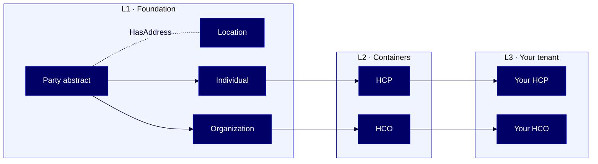

# HOWTO: Use Reltio canonical models and object inheritance

Work with Reltio's logical, three-layer data model — not the rigid physical tables and foreign keys of a relational database — to build entity types that inherit platform improvements automatically.

*L1 = Reltio-managed foundation (industry-agnostic). L2 = Reltio-managed containers (industry-specific). L3 = your tenant (yours to edit). The dashed edge from Party to Location marks a "HasAddress" reference relationship, not inheritance.*

## Overview

Reltio organizes configuration in three layers. L1 gives you industry-agnostic objects Reltio maintains. L2 adds industry-specific extensions like Life Sciences. L3 is your tenant — where you inherit L1 and L2 by reference and add your own customizations. Because inheritance is by reference, Reltio's platform improvements reach your tenant automatically.

This guide is for these Reltio roles: **Reltio Configurator**, **Solution Architect**. For more information on data unification roles in the Reltio Context Intelligence Platform, see [About roles](https://docs.reltio.com/en/roles/about-roles?utm_source=ai-corpus&utm_medium=markdown&utm_campaign=reltio-ai-ready-docs).

## Contents

1. [Getting started](#1-getting-started)
2. [Key concepts](#2-key-concepts)
3. [Understand the three-layer model](#3-understand-the-three-layer-model)
4. [Trace inheritance through a real example](#4-trace-inheritance-through-a-real-example)
5. [Extend and override attributes in L3](#5-extend-and-override-attributes-in-l3)
6. [Use the four canonical attribute types](#6-use-the-four-canonical-attribute-types)
7. [Redeclare LCAs, DVFs, and cleanse functions](#7-redeclare-lcas-dvfs-and-cleanse-functions)
8. [Troubleshooting](#8-troubleshooting)
9. [Further reading](#9-further-reading)
10. [Glossary](#10-glossary)

## 1. Getting started

Gather these before you start:

- A Reltio tenant you can configure
- Access to the Reltio Console or the Configuration API
- Familiarity with a relational data model for comparison — it makes the contrast clearer

## 2. Key concepts

Read these terms before diving into the layers.

- **[Canonical model](#glossary)** — a shared, logical definition of an object that every source maps to. Reltio's canonical models live in L1 and L2; you inherit them in L3.
- **[Object inheritance](#glossary)** — the mechanism that lets L3 reuse L1 and L2 definitions by reference instead of redefining them.
- **[L1, L2, L3 layers](#glossary)** — the three configuration layers. You only edit L3.
- **Attribute types** — simple, nested, reference, and analytic. These replace the rigid column types of a relational table.
- **[Consolidated configuration](#glossary)** — the effective configuration your tenant uses, computed by merging L1, L2, and L3.

> **Learn more:** [Tenant configuration inheritance across layers](https://docs.reltio.com/en/reltio/what-does-reltio-do/what-reltio-does-at-a-glance/data-unification-and-mdm-at-a-glance/data-unification-and-mdm-in-detail/reltio-information-model/data-model/tenant-configuration-inheritance-across-layers?utm_source=ai-corpus&utm_medium=markdown&utm_campaign=reltio-ai-ready-docs) in the Reltio documentation.

## 3. Understand the three-layer model

Each layer builds on the one below it. L3 inherits from L2, which inherits from L1.

| Layer | Who controls it | What it contains |
|---|---|---|
| **L1 — Foundation** | Reltio Product Management | Industry-agnostic objects: `Party` (abstract), `Location`, `Organization`, `Individual`, `HasAddress` relationship |
| **L2 — Containers** | Reltio Product Management | Industry-specific extensions — Life Sciences adds `[HCO](#glossary)` by extending `Organization`, and `HCP` by extending `Individual` |
| **L3 — Customer tenant** | You | Your customizations: new attributes, new entity types, and overrides of L1 or L2 |

Each layer is represented as JSON. You only touch L3. You can retrieve it, edit it, and apply it back to the tenant using the Configuration API.

> **Important:** Reltio strongly recommends configuring L3 to reference one of the industry-specific L2 containers. Doing so gives you all L1 objects plus the L2 extensions, and you keep getting Reltio's improvements to L1 and L2 automatically.

A standalone L3 is technically possible — you just remove the L2 reference — but you forfeit those automatic improvements.

> **Learn more:** [Reltio L3 Layer — Customer tenant](https://docs.reltio.com/en/reltio/what-does-reltio-do/what-reltio-does-at-a-glance/data-unification-and-mdm-at-a-glance/data-unification-and-mdm-in-detail/reltio-information-model/data-model/tenant-configuration-inheritance-across-layers/reltio-l3-layer----customer-tenant?utm_source=ai-corpus&utm_medium=markdown&utm_campaign=reltio-ai-ready-docs) in the Reltio documentation.

## 4. Trace inheritance through a real example

The Life Sciences velocity pack is a good walkthrough because you can see all three layers at work.

The chain for a Healthcare Professional:

1. **L1** defines `Party` as an abstract type, then extends it to `Individual` (a concrete type).
2. **L2 (Life Sciences)** extends `Individual` to `[HCP](#glossary)`.
3. **L3 (your tenant)** extends `HCP` to add the attributes your organization needs — for example, an internal territory ID.

Your L3 `HCP` now carries:

- Every `Party` attribute from L1
- Every `Individual` attribute from L1
- Every `HCP`-specific attribute from L2
- Your custom territory ID

None of these were duplicated in L3. They're inherited by reference.

### Why this matters

In a relational data model, adding a column to an inherited concept means altering every derived table. In Reltio, an L1 addition — say, a new field on `Party` — flows through to every `Individual`, `Organization`, `HCP`, and `HCO` automatically. The entity types gain new capability without you touching the tenant.

### Precedence

When the same object is defined in multiple layers, L3 wins over L2 wins over L1. L3 modifications **merge with and extend** the parent definition — they don't replace it outright.

> **Learn more:** [Reltio L1 Layer — Foundation](https://docs.reltio.com/en/reltio/what-does-reltio-do/what-reltio-does-at-a-glance/data-unification-and-mdm-at-a-glance/data-unification-and-mdm-in-detail/reltio-information-model/data-model/tenant-configuration-inheritance-across-layers/reltio-l1-layer--foundation?utm_source=ai-corpus&utm_medium=markdown&utm_campaign=reltio-ai-ready-docs) in the Reltio documentation.

## 5. Extend and override attributes in L3

You can change what you inherit in three ways.

### Extend

Add a new attribute or sub-attribute that doesn't exist in the lower layer. Declare it in L3 — no need to redefine the parent.

### Override

Change an existing attribute's parameters. Specify only the parameters you want to change; the rest are still inherited.

### Hide — never delete

Attributes **cannot be deleted** through inheritance. If you omit an attribute in L3, it's still there. To remove it from views, set `hidden: true`.

### Sub-attributes

To change a sub-attribute, specify only the sub-attribute that changes. The other sub-attributes are inherited from the lower-level container.

> **Note:** You must define these sub-attribute properties in your configuration or Reltio uses `false`: `Hidden`, `Important`, `System`, `skipInDataAccess`.

> **Learn more:** [Reltio object types](https://docs.reltio.com/en/reltio/what-does-reltio-do/what-reltio-does-at-a-glance/data-unification-and-mdm-at-a-glance/data-unification-and-mdm-in-detail/reltio-information-model/data-model/reltio-object-types?utm_source=ai-corpus&utm_medium=markdown&utm_campaign=reltio-ai-ready-docs) in the Reltio documentation.

## 6. Use the four canonical attribute types

This is where Reltio breaks cleanly from relational thinking. Instead of forcing every attribute into a column of a fixed data type, Reltio offers four attribute types.

| Type | What it does | When to use |
|---|---|---|
| **Simple** | Holds a single value of a primitive type — String, Integer, Boolean, Date, URL | Name, age, date of birth, status flag |
| **Nested** | Groups several sub-attributes into one meaningful collection | Phone number (number + type + area code + extension); physical description |
| **Reference** | Links one entity to another and exposes the referenced entity's attributes as if they were native | Individual referencing their previous employer (Organization) — a search for "John Smith Acme" returns only Johns linked to Acme |
| **Analytic** | Holds computed values from an analytics solution; behaves differently during merges | Customer lifetime value, propensity scores |

### Why this matters

You're building a **logical data model**, not a physical table. These four types together let you:

- **Model real-world complexity** — nested phone numbers or addresses without joins
- **Reuse attributes across entities** — reference attributes replace foreign-key acrobatics
- **Index referenced data as if native** — makes search more powerful than in any relational MDM
- **Store analytics alongside master data** — without violating schema normalization

### Simple attribute data types

Simple attributes are the only ones you must declare with a data type:

- `String`
- `Int`, `Integer`, `Long`, `Dollar` — all stored as 64-bit integers
- `Float`, `Double`, `Number` — 32-bit floating point; use `Integer` or `Long` for accurate integer handling
- `Boolean`
- `Date`, `Time`, `Timestamp`
- `Blob` — multiline text
- `URL`, `Blog URL`, `Image URL`

> **Tip:** If you need accurate integer handling in downstream systems like Snowflake, define the attribute as `Integer` or `Long` — not `Number`. Storing integers in `Float`, `Double`, or `Number` can lose precision or produce scientific notation on export.

### Reference attributes in practice

A reference attribute enables:

- **Attribute reuse** — one entity uses another's attributes natively. For example, the L1 `affiliatedWith` relationship type makes `Organization` a reference attribute of `Individual`, so an individual's profile shows employer details without duplication.
- **Easier navigation** — referenced attributes display as hyperlinks on the entity profile in the Hub.
- **Refined search** — attributes of a referenced entity are indexed as though native to the referencing entity. Search by a referenced field and the query works end-to-end.

> **Learn more:** [Reltio attribute types](https://docs.reltio.com/en/reltio/what-does-reltio-do/what-reltio-does-at-a-glance/data-unification-and-mdm-at-a-glance/data-unification-and-mdm-in-detail/reltio-information-model/data-model/reltio-object-types/reltio-attribute-types?utm_source=ai-corpus&utm_medium=markdown&utm_campaign=reltio-ai-ready-docs) in the Reltio documentation.

## 7. Redeclare LCAs, DVFs, and cleanse functions

This is the single biggest inheritance gotcha.

Entity types **inherit structural metadata** — attributes, analytical attributes, and attribute parameters. They **do not inherit functional configuration**:

- Life Cycle Actions (LCAs)
- Data Validation Functions (DVFs)
- Cleanse functions

### What this means in practice

If you define a custom entity in L3 that extends a standard Reltio entity like `HCP` or `HCO`, you must **explicitly redeclare** all LCAs, DVFs, and cleanse functions in your L3 configuration. Without this redeclaration, these components won't execute at runtime — even though they may appear in the inherited metadata.

> **Important:** Silent failures here are one of the hardest-to-diagnose issues in a Reltio configuration. If your validations aren't firing or your cleansers aren't running on a custom entity, check that you redeclared them in L3.

> **Learn more:** [Tenant configuration inheritance across layers](https://docs.reltio.com/en/reltio/what-does-reltio-do/what-reltio-does-at-a-glance/data-unification-and-mdm-at-a-glance/data-unification-and-mdm-in-detail/reltio-information-model/data-model/tenant-configuration-inheritance-across-layers?utm_source=ai-corpus&utm_medium=markdown&utm_campaign=reltio-ai-ready-docs) in the Reltio documentation.

## 8. Troubleshooting

Common issues and where to look first.

| Symptom | Cause | Fix |
|---|---|---|
| Attribute you removed from L3 still appears | Inherited attributes can't be deleted — only hidden | Set `hidden: true` on the attribute |
| Custom entity's cleanse rules don't run | Functional configuration doesn't inherit | Redeclare LCAs, DVFs, and cleanse functions in L3 |
| L3 validation errors after an L2 update | L2 changed in a way your L3 overrides don't tolerate | Review the L3 validation errors and adjust your overrides |
| Sub-attribute properties defaulting to `false` | Properties not declared | Define `Hidden`, `Important`, `System`, `skipInDataAccess` explicitly |
| Integer values appearing as scientific notation on export | Attribute declared as `Number`, `Float`, or `Double` | Redefine as `Integer` or `Long` |

## 9. Further reading

- [Tenant configuration inheritance across layers](https://docs.reltio.com/en/reltio/what-does-reltio-do/what-reltio-does-at-a-glance/data-unification-and-mdm-at-a-glance/data-unification-and-mdm-in-detail/reltio-information-model/data-model/tenant-configuration-inheritance-across-layers?utm_source=ai-corpus&utm_medium=markdown&utm_campaign=reltio-ai-ready-docs)
- [Reltio L1 Layer — Foundation](https://docs.reltio.com/en/reltio/what-does-reltio-do/what-reltio-does-at-a-glance/data-unification-and-mdm-at-a-glance/data-unification-and-mdm-in-detail/reltio-information-model/data-model/tenant-configuration-inheritance-across-layers/reltio-l1-layer--foundation?utm_source=ai-corpus&utm_medium=markdown&utm_campaign=reltio-ai-ready-docs)
- [Reltio L2 Layer — Containers](https://docs.reltio.com/en/reltio/what-does-reltio-do/what-reltio-does-at-a-glance/data-unification-and-mdm-at-a-glance/data-unification-and-mdm-in-detail/reltio-information-model/data-model/tenant-configuration-inheritance-across-layers/reltio-l2-layer----containers?utm_source=ai-corpus&utm_medium=markdown&utm_campaign=reltio-ai-ready-docs)
- [Reltio L3 Layer — Customer tenant](https://docs.reltio.com/en/reltio/what-does-reltio-do/what-reltio-does-at-a-glance/data-unification-and-mdm-at-a-glance/data-unification-and-mdm-in-detail/reltio-information-model/data-model/tenant-configuration-inheritance-across-layers/reltio-l3-layer----customer-tenant?utm_source=ai-corpus&utm_medium=markdown&utm_campaign=reltio-ai-ready-docs)
- [Reltio object types](https://docs.reltio.com/en/reltio/what-does-reltio-do/what-reltio-does-at-a-glance/data-unification-and-mdm-at-a-glance/data-unification-and-mdm-in-detail/reltio-information-model/data-model/reltio-object-types?utm_source=ai-corpus&utm_medium=markdown&utm_campaign=reltio-ai-ready-docs)
- [Reltio attribute types](https://docs.reltio.com/en/reltio/what-does-reltio-do/what-reltio-does-at-a-glance/data-unification-and-mdm-at-a-glance/data-unification-and-mdm-in-detail/reltio-information-model/data-model/reltio-object-types/reltio-attribute-types?utm_source=ai-corpus&utm_medium=markdown&utm_campaign=reltio-ai-ready-docs)
- [Configuration API](https://docs.reltio.com/en/developer-resources/system-administration-apis/system-administration-apis-at-a-glance/configuration-api?utm_source=ai-corpus&utm_medium=markdown&utm_campaign=reltio-ai-ready-docs)

## 10. Glossary

**Analytic attribute:** An attribute type that holds values delivered by an analytics solution, such as a customer lifetime value score. Behaves differently from other attribute types during merges.

**Canonical model:** A shared, logical definition of an object (entity, relationship, interaction) that every source system maps to. Reltio's canonical models live in L1 (industry-agnostic) and L2 (industry-specific).

**Consolidated configuration:** The effective tenant configuration produced by merging L1, L2, and L3. Also called the tenant configuration or metadata configuration.

**HCO:** Health Care Organization — a Life Sciences entity type in L2 that inherits from `Organization` in L1.

**HCP:** Healthcare Professional — a Life Sciences entity type in L2 that inherits from `Individual` in L1.

**L1, L2, L3 layers:** The three configuration layers in the Reltio inheritance model. L1 is Reltio's foundation, L2 adds industry-specific containers, L3 is your tenant. Only L3 is customer-editable.

**Nested attribute:** An attribute type that groups several sub-attributes into a single collection — for example, a phone number broken into number, type, area code, and extension.

**Object inheritance:** The mechanism by which L3 reuses definitions from L1 and L2 by reference, rather than redefining them.

**Reference attribute:** An attribute type that links one entity to another and exposes the referenced entity's attributes as if they were native, enabling cross-entity search and navigation.

**Simple attribute:** An attribute type that holds a single value of a primitive data type such as String, Integer, Boolean, or Date.

**Standalone L3:** An L3 configuration that does not reference an L2 container. Technically possible but forfeits automatic Reltio platform improvements.

---

> **Disclaimer:** AI-generated from the Reltio documentation snapshot 2026-04-22 02:14 UTC (3,233 topics). AI output can contain subtle inaccuracies, and the knowledge base syncs twice a week — so the content here may lag [docs.reltio.com](https://docs.reltio.com). Verify anything critical against the official docs and your own tenant. See the [full disclaimer](../DISCLAIMER.md).
