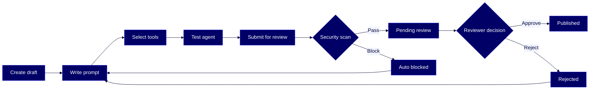

# HOWTO: Use the Agent Builder for AgentFlow

Author, test, submit, review, and publish custom AI agents in Reltio [AgentFlow](#glossary) through a governed lifecycle — from draft through automated [security scan](#glossary) to reviewer approval and live publication.

## Overview

[Agent Builder](#glossary) is the authoring and governance surface inside [AgentFlow](#glossary). [Agent Authors](#glossary) create a custom agent by writing a [system prompt](#glossary), selecting the [tools](#glossary) the agent is allowed to call, and testing it interactively. When the author submits a [publish request](#glossary), an automated [security scan](#glossary) checks the prompt for policy violations. Clean requests enter the [Agent Approver's](#glossary) queue; violations are [auto-blocked](#glossary) before a human sees them. Once approved, the agent is published as an [immutable version](#glossary) and appears in **Discover Agents** for end users. This guide walks through the full lifecycle — authoring, scanning, reviewing, and managing state transitions — covering both the author and approver workflows.

This guide is for these Reltio roles: **Developer**, **Reltio Configurator**, **Data Product Owner**. For more information on data unification roles in the Reltio Context Intelligence Platform, see [About roles](https://docs.reltio.com/en/roles/about-roles).

## Contents

1. [Getting started](#1-getting-started)
2. [Key concepts](#2-key-concepts)
3. [Create a draft agent](#3-create-a-draft-agent)
4. [Write the system prompt](#4-write-the-system-prompt)
5. [Select tools](#5-select-[tools](#glossary))
6. [Test the draft agent](#6-test-the-draft-agent)
7. [Submit the agent for review](#7-submit-the-agent-for-review)
8. [Review and act on a publish request](#8-review-and-act-on-a-publish-request)
9. [Update a published agent](#9-update-a-published-agent)
10. [Agent states reference](#10-agent-states-reference)
11. [Troubleshooting](#11-troubleshooting)
12. [Further reading](#12-further-reading)
13. [Glossary](#13-glossary)

## 1. Getting started

Gather these before you start:

| What | Details |
|------|---------|
| **AgentFlow access** | You can sign in to [AgentFlow](#glossary) and open the [Agent Builder](#glossary) surface |
| **Author role** | `ROLE_AGENT_AUTHOR` on the target tenant (to create, test, and submit agents) |
| **Approver role** | `ROLE_AGENT_APPROVER` on the target tenant (to review publish requests) — at least one user on the tenant must have PUBLISH permission |
| **Tenant MCP and agent roles** | `ROLE_EXECUTE_MCP` and `ROLE_EXECUTE_AGENTS` (required for AgentFlow execution) |
| **System roles** | `ROLE_USER` and `ROLE_API` on the target tenant |
| **Tool catalog** | The tools your agent will call must already be in the tenant-approved tool catalog |

> **Learn more:** [AgentFlow capabilities and permissions](https://docs.reltio.com/en/products/agentflow/reltio-agentflow-at-a-glance/agentflow-capabilities-and-permissions) in the Reltio documentation.

## 2. Key concepts

Before you author your first agent, familiarize yourself with the four roles and the state machine that governs every agent:

- **Agent Author** — Writes the [system prompt](#glossary), selects tools, tests the draft, and submits a [publish request](#glossary). Can withdraw a pending request and return the draft to editable state.
- **Agent Approver** — Reviews publish requests that passed the security scan. Can approve (publish the agent) or reject with a reason (return it to the author).
- **Agent Admin** — Can update any published agent and archive agents. Archived agents are retained for audit but removed from **Discover Agents**.
- **End User** — Discovers published agents in the catalog and starts conversations with them.

Every agent moves through a defined state machine: **Draft → Scanning → Pending review → Published** (happy path), with branches into **Auto blocked** (scan violation) and **Rejected** (reviewer rejection). Once an agent is published, its version is immutable; saving further edits creates a new draft version while the published version stays live for end users.

> **Learn more:** [Agent Builder for AgentFlow at a glance](https://docs.reltio.com/en/products/agentflow/reltio-agentflow-at-a-glance/agent-builder-for-agentflow-at-a-glance) in the Reltio documentation.

## 3. Create a draft agent

Use this path when you are building a new agent from scratch. If you are updating an existing published agent instead, skip to [section 9](#9-update-a-published-agent).

1. Open **AgentFlow** and go to **Agent Builder**.
2. Select **Create agent**.
3. Enter a name, description, and any relevant tags. These values appear in **Discover Agents** after the agent is published, so make them descriptive and end-user-friendly.
4. Save the agent. Agent Builder creates it in **Draft** state.

### Verify it worked

- Open the **Your Drafts & Requests** tab and confirm the new agent appears with **Draft** status.
- Open the agent editor and confirm the **Basics**, **Prompt**, **Tools**, and **Test** navigation tabs are visible.

> **Learn more:** [Create, test, and submit an agent for review](https://docs.reltio.com/en/products/agentflow/reltio-agentflow-at-a-glance/agent-builder-for-agentflow-at-a-glance/create-test-and-submit-an-agent-for-review) in the Reltio documentation.

## 4. Write the system prompt

The [system prompt](#glossary) is the complete instruction set the model evaluates when the agent starts. It is limited to a maximum of **100,000 characters, including spaces**. Every save in the prompt editor increments the agent's minor version number.

1. In the agent editor, open the **Prompt** tab.
2. Enter the system prompt. A well-structured prompt covers the agent's **identity**, **objectives**, **tool usage rules**, **workflow**, **guardrails**, **output format**, and **error handling behavior**.
3. Save your changes.

### Recommended structure

Reltio recommends the following ten-section structure as the default starting point for production-ready prompts:

| Section | Name | What it defines |
|---------|------|-----------------|
| 1 | Identity | Who is this agent? |
| 2 | Objectives | What does it accomplish? |
| 3 | First-turn behavior | How does it greet users? |
| 4 | Tone and style | How does it communicate? |
| 5 | Tools | What tools are available? |
| 6 | Workflow | What steps does it follow? |
| 7 | Guardrails | What are the boundaries? |
| 8 | Output format | How should responses look? |
| 9 | Error handling | How to handle failures? |
| 10 | Internal logic | Hidden decision algorithms (optional) |

> **Note:** This structure is a recommended convention — the Agent Builder authoring surface does not enforce it automatically. You apply it yourself in the prompt text area.

### The five golden rules

Apply these rules to every system prompt, regardless of agent type:

- **Be explicit** — Never assume the model will infer requirements.
- **Be specific** — Use exact examples, formats, and values.
- **Be structured** — Use headers, bullets, and numbered lists consistently.
- **Be transparent** — Always show tools used with inputs.
- **Be safe** — Require confirmation for destructive actions.

### Anti-patterns to avoid

The following patterns produce unreliable agent behavior and should not appear in production prompts:

| Anti-pattern | Problem | Correct approach |
|--------------|---------|------------------|
| Vague instructions | "Use appropriate tool" — no selection criterion | Specify the exact tool for each condition |
| Missing error handling | Tool failures crash the flow with no recovery path | Always include recovery paths |
| Flattery | "Great question!" — adds noise and erodes trust | Just answer: "Sure — here's..." |
| Hardcoded values | "Use Individual type" — assumes a fixed value | Validate dynamically |
| Unstructured workflow | "Help user with matches" — no steps, no decision points | Number each step explicitly |
| No confirmation | Immediate destructive actions with no user approval | Always confirm before modify or delete |

> **Learn more:** [AgentFlow system prompt guidelines](https://docs.reltio.com/en/products/agentflow/reltio-agentflow-at-a-glance/agent-builder-for-agentflow-at-a-glance/agentflow-system-prompt-guidelines) in the Reltio documentation.

## 5. Select tools

The agent can only call tools you explicitly select — this selection is the agent's tool **allowlist**. Tools must already be in the tenant-approved catalog to appear here.

1. In the agent editor, open the **Tools** tab.
2. Search or scroll the **MCP Servers and Tools** panel on the left to find the tools you want this agent to use.
3. Select the checkbox next to each tool to add it to the allowlist.
4. Save your changes.

> **Note:** If you submit the agent without selecting any tools, Agent Builder displays a warning before submission. You can still proceed, but the agent will have no approved actions available at runtime.

### Verify it worked

- Confirm each tool you selected appears in the right-hand allowlist panel.
- Confirm the system prompt documents each selected tool in its **Tools** section (section 5 of the recommended structure) with clear selection criteria.

> **Learn more:** [Create, test, and submit an agent for review](https://docs.reltio.com/en/products/agentflow/reltio-agentflow-at-a-glance/agent-builder-for-agentflow-at-a-glance/create-test-and-submit-an-agent-for-review) in the Reltio documentation.

## 6. Test the draft agent

Testing runs the same automated [security scan](#glossary) that runs on submission. A test run with a prompt violation is blocked before execution — this is a build-time check, not a runtime conversation guardrail.

1. Open the **Test** tab in the agent editor.
2. Enter a prompt in the chat panel and review the streaming response.
3. Review the **Execution Log** on the right after each test. It shows latency, tokens used, and tool calls for that run.
4. Iterate on the system prompt and tool selection. Save your changes and retest until the agent behaves as intended.

> **Note:** If the security scan detects a violation in the system prompt during a test run, the test is blocked. Revise the prompt before testing again.

### Verify it worked

- Confirm the agent's responses follow the output format defined in your system prompt.
- Confirm every tool call the agent makes is from the allowlist you configured in [section 5](#5-select-tools).
- Confirm destructive actions (if any) ask for user confirmation before executing.

> **Learn more:** [System prompt security scan](https://docs.reltio.com/en/products/agentflow/reltio-agentflow-at-a-glance/agent-builder-for-agentflow-at-a-glance/system-prompt-security-scan) in the Reltio documentation.

## 7. Submit the agent for review

When the draft is ready, submit a [publish request](#glossary). The system runs the security scan automatically before the request reaches a reviewer.

1. In the agent editor, select the publish action.
2. Optionally add version notes. These are visible to the reviewer alongside the agent configuration.
3. Confirm the submission.

One of two outcomes follows:

| Scan result | What happens |
|-------------|--------------|
| `pass` | The agent transitions to **Pending review**. The request enters the approver's queue. |
| `blocked` | The request is **auto-blocked**. You receive a notification with the `policy_category` of the violation. Revise the prompt and submit again. |

If the agent already has a previously published version, that version **remains live** in **Discover Agents** throughout the review. End users keep using the current published version until a reviewer approves the new one.

### Withdraw a pending request

If you need to make changes after submitting, withdraw the pending request at any time. Withdrawing returns the agent to **Draft** state and unlocks the editor.

### Verify it worked

- Confirm the agent shows **Pending review** (or **Auto blocked**) status in the **Your Drafts & Requests** tab.
- If the scan blocked the request, confirm the scan result shows a `policy_category` value.

> **Learn more:** [Create, test, and submit an agent for review](https://docs.reltio.com/en/products/agentflow/reltio-agentflow-at-a-glance/agent-builder-for-agentflow-at-a-glance/create-test-and-submit-an-agent-for-review) in the Reltio documentation.

## 8. Review and act on a publish request

This section applies to users with `ROLE_AGENT_APPROVER`. When an author submits a request and the scan passes, the request appears in the reviewer queue.

### Open and review the request

1. Log in to **AgentFlow** and go to **Agent Builder**.
2. Select the **Review requests** tab. The queue lists every pending request with the agent name, submitter, and submission timestamp.
3. Select a request to open the detail view.
4. Review the agent configuration:
   - Agent metadata: name, description, and tags.
   - System prompt content.
   - Tool configuration and allowlist.
   - Scan results: status and any `policy_category` value if a violation was detected.
5. Optionally, select **Test** to run the agent yourself before making a decision. The test panel opens alongside the request detail view.

### Approve the request

1. Select the approve action.
2. Confirm the approval.

Agent Builder publishes the agent as an **immutable version**, makes it discoverable in **Discover Agents**, and records an audit entry with your identity and the decision. If the agent already had a published version, the newly approved version becomes the active published version.

### Reject the request

1. Select the reject action.
2. Enter a rejection reason. The reason is visible to the author when they view the request details.
3. Confirm the rejection.

The author can revise the agent and resubmit. The previously published version, if one exists, remains live.

### Verify it worked

- After approval: confirm the agent status shows **Published** in the **All Agents** tab.
- After approval: open **Discover Agents** and confirm the agent appears with the correct name and description.
- After rejection: confirm the author sees the rejection reason and that the agent returned to the author's editable state.

> **Learn more:** [Review and act on a publish request](https://docs.reltio.com/en/products/agentflow/reltio-agentflow-at-a-glance/agent-builder-for-agentflow-at-a-glance/review-and-act-on-a-publish-request) in the Reltio documentation.

## 9. Update a published agent

Use this path when you want to revise an agent that is already published. An [Agent Author](#glossary) (for their own agents) or an [Agent Admin](#glossary) can initiate an update. The published version remains live and available to users throughout the editing and review process.

1. Sign in to **AgentFlow** and go to **Agent Builder**.
2. Locate the published agent in the **All Agents** tab.
3. Select the option to create a new version. Agent Builder creates a new draft version. The latest published version stays active in **Discover Agents**.
4. Edit the system prompt and tool selection. Follow [section 4](#4-write-the-system-prompt) and [section 5](#5-select-tools).
5. Test the draft per [section 6](#6-test-the-draft-agent).
6. Submit the new version for review per [section 7](#7-submit-the-agent-for-review).

Version history is maintained across all draft and published versions of the agent, so you can track what changed between published releases.

> **Learn more:** [Create, test, and submit an agent for review](https://docs.reltio.com/en/products/agentflow/reltio-agentflow-at-a-glance/agent-builder-for-agentflow-at-a-glance/create-test-and-submit-an-agent-for-review) in the Reltio documentation.

## 10. Agent states reference

Agent Builder tracks the state of each agent throughout its lifecycle. The state determines which actions are available to the author, reviewer, and admin at any point.

### States visible in Your Drafts & Requests

| State | Description |
|-------|-------------|
| **Draft** | The agent is being created or edited. The author can update the system prompt, tool configuration, and test the agent. Each save increments the minor version number. Not yet available to end users. |
| **Scanning** | The author submitted the agent for review and the system prompt security scan is in progress. The draft cannot be edited while the scan runs. This state is brief — it resolves automatically within seconds. |
| **Pending review** | The scan completed with no violations. The publish request is now in the reviewer's queue. The draft cannot be edited until the reviewer acts or the author withdraws the request. |
| **Auto blocked** | The scan detected a security violation in the system prompt. The publish request did not reach the reviewer queue. The author can revise the prompt and resubmit. Saving any edit returns the agent to **Draft**. |
| **Rejected** | The reviewer rejected the publish request with a reason. The author can view the rejection reason, modify the agent, and resubmit. Saving any edit returns the agent to **Draft**. |

### States visible in All Agents

| State | Description |
|-------|-------------|
| **Published** | The agent was approved by a reviewer and is available to end users in **Discover Agents**. Published versions are immutable. If the author makes further changes, a new draft version is created while the current published version remains live. |
| **Archived** | The agent is no longer available in **Discover Agents** or usable in conversations. Archiving is an admin action. The agent is retained for audit purposes. |

### Transition rules

- **Submit for review** — Draft → Scanning → Pending review (if scan passes) or Draft → Scanning → [Auto blocked](#glossary) (if a violation is detected).
- **Approve** — Pending review → Published. The agent appears in the **All Agents** tab.
- **Reject** — Pending review → Rejected.
- **Edit a rejected or auto-blocked agent** — returns the agent to Draft.
- **Withdraw a pending request** — returns the agent to Draft.
- **Archive** (admin action) — moves the agent to Archived.

> **Learn more:** [Agent states in Agent Builder](https://docs.reltio.com/en/products/agentflow/reltio-agentflow-at-a-glance/agent-builder-for-agentflow-at-a-glance/agent-states-in-agent-builder) in the Reltio documentation.

## 11. Troubleshooting

| Issue | Likely cause | What to try |
|-------|--------------|-------------|
| Submit action unavailable | You do not have `ROLE_AGENT_AUTHOR` on the tenant, or no user on the tenant has `ROLE_AGENT_APPROVER` with PUBLISH permission | Ask your System Administrator to assign the required roles |
| Request auto-blocked on submit | The security scan detected a `policy_category` violation in the system prompt | Open the scan result, identify the [policy category](#glossary), revise the offending section of the prompt, and submit again |
| Test run blocked | Same build-time scan as submission; violation in the current prompt | Revise the prompt and retest. The scan re-runs on every test |
| Tool not visible when selecting | The tool is not in the tenant-approved catalog | Ask your Agent Admin to add the tool to the catalog |
| Approve action unavailable | You have `ROLE_AGENT_APPROVER` but not PUBLISH permission | Ask your System Administrator to grant PUBLISH permission |
| Rejected agent cannot be edited | The UI still shows Rejected state | Save any edit in the editor — this returns the agent to Draft automatically |
| Published version replaced unexpectedly | A new version was approved while you were not watching | Check the agent's version history; the previous published version is retained for audit |

## 12. Further reading

- [Agent Builder for AgentFlow at a glance](https://docs.reltio.com/en/products/agentflow/reltio-agentflow-at-a-glance/agent-builder-for-agentflow-at-a-glance) — official overview
- [Create, test, and submit an agent for review](https://docs.reltio.com/en/products/agentflow/reltio-agentflow-at-a-glance/agent-builder-for-agentflow-at-a-glance/create-test-and-submit-an-agent-for-review) — author workflow
- [Review and act on a publish request](https://docs.reltio.com/en/products/agentflow/reltio-agentflow-at-a-glance/agent-builder-for-agentflow-at-a-glance/review-and-act-on-a-publish-request) — approver workflow
- [AgentFlow system prompt guidelines](https://docs.reltio.com/en/products/agentflow/reltio-agentflow-at-a-glance/agent-builder-for-agentflow-at-a-glance/agentflow-system-prompt-guidelines) — deep dive on prompt structure and anti-patterns
- [Agent states in Agent Builder](https://docs.reltio.com/en/products/agentflow/reltio-agentflow-at-a-glance/agent-builder-for-agentflow-at-a-glance/agent-states-in-agent-builder) — full state machine
- [System prompt security scan](https://docs.reltio.com/en/products/agentflow/reltio-agentflow-at-a-glance/agent-builder-for-agentflow-at-a-glance/system-prompt-security-scan) — what the scan checks and how to read results
- [Reltio AgentFlow™ at a glance](https://docs.reltio.com/en/products/agentflow/reltio-agentflow-at-a-glance) — parent product overview
- [AgentFlow capabilities and permissions](https://docs.reltio.com/en/products/agentflow/reltio-agentflow-at-a-glance/agentflow-capabilities-and-permissions) — RBAC model, system roles, and tenant prerequisites

## 13. Glossary

**Agent Admin:** A role in Agent Builder that can update any published agent and archive agents. Archived agents are retained for audit purposes but removed from Discover Agents.

**Agent Approver:** A role in Agent Builder that reviews pending publish requests and decides whether to approve (publish) or reject (return to author). Requires `ROLE_AGENT_APPROVER` on the tenant.

**Agent Author:** A role in Agent Builder that creates, edits, tests, and submits agents for publish review. Requires `ROLE_AGENT_AUTHOR` on the tenant.

**Agent Builder:** The authoring and governance surface within AgentFlow. It is where authors create, test, and submit AI agents, and where approvers review and publish them.

**AgentFlow:** Reltio's product for real-time, AI-driven data stewardship through secure, governed conversations with purpose-built agents. Agent Builder is one of its surfaces.

**Auto blocked:** An agent state reached when the automated security scan detects a policy violation in the system prompt during submission. The publish request does not reach a reviewer. The author can revise the prompt and resubmit.

**Discover Agents:** The catalog of published agents that end users browse to start conversations. Archived and draft agents do not appear here.

**Immutable version:** A published agent version that cannot be edited in place. Further changes create a new draft version while the immutable published version stays live.

**Policy category:** A classifier value returned by the security scan when a system prompt is blocked, identifying the type of violation detected. If the scanner cannot classify the violation, the value is `UNKNOWN`.

**Publish request:** The submission a Agent Author creates to move a draft into review. Every publish request triggers an automated security scan before reaching an approver.

**Security scan:** The automated system prompt scan that runs on every submission and every test run. Result is either `pass` (proceeds) or `blocked` (auto-blocked with a `policy_category`).

**System prompt:** The complete instruction set the model evaluates when an agent starts. Limited to 100,000 characters including spaces. Defines the agent's identity, objectives, tool usage rules, workflow, guardrails, output format, and error handling.

**Tools:** The functions an agent is allowed to call. Only tools in the tenant-approved catalog can be added to an agent's allowlist. An agent cannot call tools outside its allowlist.

---

> **Disclaimer:** AI-generated from the Reltio documentation snapshot 2026-04-23 02:14 UTC (3,233 topics). AI output can contain subtle inaccuracies, and the knowledge base syncs twice a week — so the content here may lag [docs.reltio.com](https://docs.reltio.com). Verify anything critical against the official docs and your own tenant. See the [full disclaimer](../DISCLAIMER.md).
