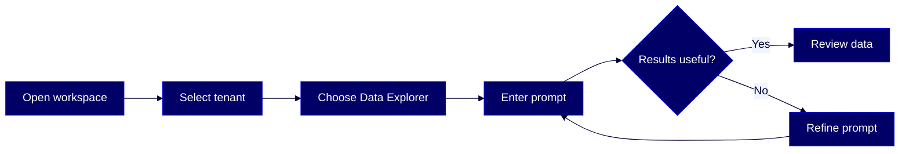

# HOWTO: Use the AgentFlow Data Explorer Agent

Explore your Reltio master data through natural language — search entity profiles, trace merge history, inspect your data model, and review match analytics, all without touching a single record.

## Overview

The **[Data Explorer](#glossary)** agent in **[AgentFlow](#glossary)** lets you query your Reltio master data using plain language instead of API calls. This guide covers how to access the agent, write prompts that produce reliable results, and avoid common patterns that stall or mislead it.

This guide is for these Reltio roles: **Business User**, **Data Steward**, **Reltio Configurator**, **Solution Architect**. For more information on data unification roles in the Reltio Context Intelligence Platform, see [About roles](https://docs.reltio.com/en/roles/about-roles?utm_source=ai-corpus&utm_medium=markdown&utm_campaign=reltio-ai-ready-docs).

## Contents

1. [Getting started](#1-getting-started)
2. [Key concepts](#2-key-concepts)
3. [Open and launch Data Explorer](#3-open-and-launch-data-explorer)
4. [Write effective prompts](#4-write-effective-prompts)
5. [Common tasks](#5-common-tasks)
6. [Limitations and safeguards](#6-limitations-and-safeguards)
7. [Troubleshooting](#7-troubleshooting)
8. [Further reading](#8-further-reading)
9. [Glossary](#9-glossary)

## 1. Getting started

Before you begin, confirm the following:

- Your Reltio tenant has AgentFlow enabled.
- Your account has the required system roles assigned (see table below).
- You have read-level access to the [entity](#glossary) types you want to explore. Attribute masking rules apply — attributes you cannot see in the Reltio Console will not appear in agent responses.

**Required system roles:**

| Role | Purpose |
|---|---|
| `ROLE_USER` | Base Reltio platform access |
| `ROLE_API` | API-level access (required for [MCP server](#glossary)) |
| `ROLE_EXECUTE_MCP` | Grants permission to execute MCP server functions |
| `ROLE_EXECUTE_AGENTS` | Grants permission to use AgentFlow agents |

> **Note:** `ROLE_EXECUTE_MCP` is a prerequisite for `ROLE_EXECUTE_AGENTS`. Both must be present. If you're unsure whether your account has these roles, contact your **System Administrator**.

Data Explorer does not require a separate license. It is included with AgentFlow access.

> **Learn more:** [AgentFlow capabilities and permissions](https://docs.reltio.com/en/products/agentflow/reltio-agentflow-at-a-glance/agentflow-capabilities-and-permissions?utm_source=ai-corpus&utm_medium=markdown&utm_campaign=reltio-ai-ready-docs) in the Reltio documentation.

## 2. Key concepts

**AgentFlow** is the conversational AI workspace in the Reltio Context Intelligence Platform. Each conversation is scoped to one [agent](#glossary) and one task — you can't switch agents mid-conversation.

The **Data Explorer** agent is read-only. It translates your natural language prompts into governed API calls through the **MCP server**, retrieves entity details, relationships, match analytics, and tenant metadata, and returns results in a readable format. It cannot create, update, merge, or delete records.

Every response respects your tenant's [RBAC](#glossary) policies and attribute masking rules. If you don't have access to a specific attribute or entity type, the agent won't display that data.

The agent runs in AgentFlow through the MCP server in read-only mode — its design makes accidental data modifications impossible.

> **Learn more:** [Reltio AgentFlow at a glance](https://docs.reltio.com/en/products/agentflow/reltio-agentflow-at-a-glance?utm_source=ai-corpus&utm_medium=markdown&utm_campaign=reltio-ai-ready-docs) in the Reltio documentation.

## 3. Open and launch Data Explorer

Follow these steps to start a Data Explorer session:

1. Open the [AgentFlow workspace](https://reltio.ai/agent-flow) in your browser.
2. When prompted, select your **tenant** and **environment**.
3. In the left navigation panel, look for **Data Explorer** under **RELTIO AGENTS**. On your first login, Data Explorer appears there by default.
4. If Data Explorer isn't in your panel, select **Discover agents**, find the **Data Explorer** card, and launch it. Once launched, it stays in the left panel across sessions.
5. Select **Data Explorer** to open a new conversation.
6. Type your question or instruction in the input field and press **Enter** or select the send icon.

> **Important:** Each conversation is scoped to one agent. If you need to take an action (such as merging records), start a new conversation and select the appropriate agent — for example, **Resolver** for merge decisions.

> **Learn more:** [Use the AgentFlow workspace](https://docs.reltio.com/en/products/agentflow/reltio-agentflow-at-a-glance/use-the-agentflow-workspace?utm_source=ai-corpus&utm_medium=markdown&utm_campaign=reltio-ai-ready-docs) in the Reltio documentation.

## 4. Write effective prompts

The quality of Data Explorer responses depends almost entirely on how you write your prompts. These patterns produce consistent, reliable results.

### Use exact schema labels

Always refer to attributes by their exact name in your tenant's data model — not by a description of what they represent.

| ✅ Works | ⚠️ Unreliable |
|---|---|
| `Find HCPs with more than 10 Addresses` | `Find HCPs with more than 10 address records` |
| `Show the HCOAffiliation count for this entity` | `How many hospital affiliations does this entity have?` |

If you're unsure of the exact attribute name, start by asking the agent: *"What's the data model for my tenant?"* — it will list the entity types, attributes, and relationship types available to you.

### Include the entity type

Always specify the entity type (for example, **HCP**, **Organization**, **Customer**, **Location**) so the agent has a clear search target. Open-ended queries across multiple entity types produce large, unfocused responses.

| ✅ Specific | ⚠️ Too broad |
|---|---|
| `Find HCP profiles in New York with a missing email` | `Find profiles with a missing email` |
| `How many Organizations are in California?` | `How many records are in California?` |

### Anchor complex lookups on entity IDs

For merge history, relationship traversal, or data quality checks on specific profiles, provide the entity ID or URI rather than relying on name matching.

| ✅ Works | ⚠️ Unreliable |
|---|---|
| `Show me the merge history for entity 00Ei8qS` | `Show me the merge history for John Smith at Reltio Corp` |
| `Does entity 00Ei8qS have duplicate addresses?` | `Does John Smith in New York have duplicate addresses?` |

### Break multi-step questions into sequences

Data Explorer processes one query at a time. For complex traversals, send prompts in steps rather than one compound question.

**Instead of:**
> *"List all HCPs affiliated with The Homestead at Soldiers and Sailors Memorial Hospital."*

**Try:**
> 1. *"Find the entity for 'The Homestead at Soldiers and Sailors Memorial Hospital' and show me its entity ID."*
> 2. *"Show me HCPs affiliated with this hospital using Contact Affiliation relationships (entity ID XYZ)."*

Breaking the request helps the agent resolve each step without guessing at relationship types or entity names.

### Scope large queries

Queries that scan large portions of your tenant may hit scanning limits or time out. If you get incomplete results, narrow the scope:

- Add a geographic or attribute filter
- Lower the count threshold
- Ask for a sample first: *"...start with a small sample I can review"*

Use Data Explorer for exploration and discovery. For precise bulk counts over large datasets, use Reltio UI advanced search.

> **Learn more:** [Prompt samples for Data Explorer](https://docs.reltio.com/en/products/agentflow/reltio-agentflow-at-a-glance/agentflow-agents-catalog/data-explorer/prompt-samples-for-data-explorer?utm_source=ai-corpus&utm_medium=markdown&utm_campaign=reltio-ai-ready-docs) in the Reltio documentation.

## 5. Common tasks

### Search and retrieve entities

Find records by free text, attribute filters, or entity ID:

- *"Find the Organization record for XYZ Corp."*
- *"Show me the HCP profile for entity `entities/abc123`."*
- *"How many customers do we have in New York City?"*

The agent returns entity details — URI, labels, attributes, source system [crosswalks](#glossary), and pagination-supported search results.

### Explore relationships

Navigate the relationship graph from a known entity:

- *"Show me all organizations affiliated with entity `entities/abc123`."*
- *"Tell me about relationships in my tenant."*

Specify the relationship type when you know it to give the agent a precise traversal path and reduce ambiguity.

### Inspect match history and lineage

Review how a [golden record](#glossary) was formed and which source systems contributed:

- *"Show me the merge history for entity `00Ei8qS`."*
- *"Analyze this HCP profile for data quality issues: `entities/00Ei8qS`."*
- *"Does entity `00Ei8qS` have duplicate addresses?"*

The agent returns merge timelines, contributing source systems, match scores, and the rules that triggered the merges.

### Discover your data model

Get a clear picture of how your tenant is structured before running complex queries:

- *"What's the data model for my tenant?"*
- *"Tell me about your capabilities, including a list of tools."*
- *"What entity types and relationship types exist in this environment?"*

Starting with a data model query is especially useful when you're working in an unfamiliar tenant. The agent will summarize entity types, relationship types, graph types, and groupings in a single response.

> **Learn more:** [AgentFlow agents catalog](https://docs.reltio.com/en/products/agentflow/reltio-agentflow-at-a-glance/agentflow-agents-catalog?utm_source=ai-corpus&utm_medium=markdown&utm_campaign=reltio-ai-ready-docs) in the Reltio documentation.

## 6. Limitations and safeguards

Understanding what Data Explorer cannot do is as important as knowing what it can.

**Read-only by design:**

- Cannot create, update, merge, unmerge, or delete records.
- For merge and unmerge actions, use the **Resolver** or **Unmerger** agents in a separate conversation.

**RBAC enforcement:**

- All attribute masking rules are applied — attributes you don't have access to are not returned.
- Response scope is limited to your data access permissions. If results look incomplete, verify your roles with your **System Administrator**.

**Scanning limits:**

- Large, open-ended queries may return partial results or time out.
- The agent processes one query at a time.

**Tenant-specific accuracy:**

- Prompts that reference collection counts (for example, *"more than 10 Addresses"*) depend on your entity type configuration supporting those patterns.
- If your tenant models addresses differently (for example, as nested Location entities rather than a multi-valued attribute named **Addresses**), provide custom instructions with concrete filter examples for your schema. The agent needs these to apply the correct attribute paths.

> **Learn more:** [Data Explorer](https://docs.reltio.com/en/products/agentflow/reltio-agentflow-at-a-glance/agentflow-agents-catalog/data-explorer?utm_source=ai-corpus&utm_medium=markdown&utm_campaign=reltio-ai-ready-docs) in the Reltio documentation.

## 7. Troubleshooting

| Symptom | Likely cause | What to do |
|---|---|---|
| Agent returns empty results for a filter | Attribute name doesn't match the schema label | Ask *"What's the data model for my tenant?"* to find the exact name, then re-run |
| Response stalls or looks incomplete | Query scans too large a dataset | Narrow the scope — add entity type, geography, or ask for a sample |
| Agent can't find a named entity | Ambiguous name with multiple matches | Provide an entity ID or URI instead of a display name |
| Attribute values missing from response | Account doesn't have access to that attribute | Contact your **System Administrator** to verify RBAC permissions |
| Can't traverse a relationship chain | Relationship type is ambiguous or missing from the prompt | Break into two prompts: find the source entity ID first, then traverse by relationship type |
| Responses carry stale context | Previous conversation thread still active | Start a new conversation to clear the agent's context |

## 8. Further reading

- [Reltio AgentFlow at a glance](https://docs.reltio.com/en/products/agentflow/reltio-agentflow-at-a-glance?utm_source=ai-corpus&utm_medium=markdown&utm_campaign=reltio-ai-ready-docs)
- [AgentFlow agents catalog](https://docs.reltio.com/en/products/agentflow/reltio-agentflow-at-a-glance/agentflow-agents-catalog?utm_source=ai-corpus&utm_medium=markdown&utm_campaign=reltio-ai-ready-docs)
- [Data Explorer agent](https://docs.reltio.com/en/products/agentflow/reltio-agentflow-at-a-glance/agentflow-agents-catalog/data-explorer?utm_source=ai-corpus&utm_medium=markdown&utm_campaign=reltio-ai-ready-docs)
- [Prompt samples for Data Explorer](https://docs.reltio.com/en/products/agentflow/reltio-agentflow-at-a-glance/agentflow-agents-catalog/data-explorer/prompt-samples-for-data-explorer?utm_source=ai-corpus&utm_medium=markdown&utm_campaign=reltio-ai-ready-docs)
- [AgentFlow capabilities and permissions](https://docs.reltio.com/en/products/agentflow/reltio-agentflow-at-a-glance/agentflow-capabilities-and-permissions?utm_source=ai-corpus&utm_medium=markdown&utm_campaign=reltio-ai-ready-docs)
- [Use the AgentFlow workspace](https://docs.reltio.com/en/products/agentflow/reltio-agentflow-at-a-glance/use-the-agentflow-workspace?utm_source=ai-corpus&utm_medium=markdown&utm_campaign=reltio-ai-ready-docs)

## 9. Glossary

**Agent:** A purpose-built AI assistant in AgentFlow designed to handle a specific type of task — such as exploring data, resolving duplicates, or enriching addresses — through governed API calls.

**AgentFlow:** The conversational AI workspace in the Reltio Context Intelligence Platform where users interact with master data through purpose-built agents. Each conversation is scoped to one agent and one task.

**Crosswalk:** A reference that links a Reltio entity back to its record in a source system, including the source name and source-system identifier.

**Data Explorer:** A read-only AgentFlow agent that translates natural language prompts into governed API calls to retrieve entity details, relationships, match analytics, and tenant metadata — without modifying any records.

**Entity:** The core data object in Reltio. An entity represents a real-world object (person, organization, product) with attributes, relationships, and source system crosswalks unified into a single golden record.

**Golden record:** The unified master data profile that Reltio assembles from multiple source system records for a single real-world entity.

**MCP server:** The Model Context Protocol server that routes AgentFlow agent requests to Reltio's governed APIs, enforcing RBAC and audit controls on every call.

**RBAC (role-based access control):** The permission system that controls which users can access which data and perform which actions in the Reltio Context Intelligence Platform. Data Explorer respects all RBAC rules, including attribute masking.

---

> **Disclaimer:** AI-generated from the Reltio documentation snapshot 2026-04-24 14:51 UTC (3,238 topics). AI output can contain subtle inaccuracies, and the knowledge base syncs twice a week — so the content here may lag [docs.reltio.com](https://docs.reltio.com). Verify anything critical against the official docs and your own tenant. See the [full disclaimer](../DISCLAIMER.md).
