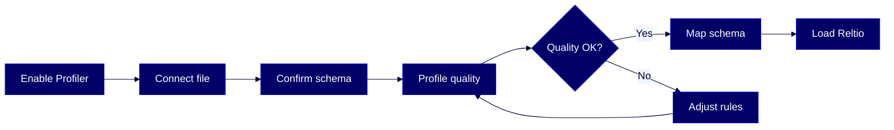

# HOWTO: Use the Profiler Agent in AgentFlow

Assess your source data quality, review column-level metrics, fix validation rules, and load clean data into Reltio — all through a conversational interface in [AgentFlow](#glossary).



## Overview

The [Profiler](#glossary) agent is a pre-ingestion data quality assistant in [AgentFlow](#glossary). It connects to structured files in cloud storage or [SFTP](#glossary), previews file structure, computes column-level quality scores, identifies issues with ranked suggestions, and optionally maps source fields to your tenant schema for loading via [Data Loader](#glossary). This guide walks you through enabling the agent, running your first profiling job, interpreting results, and loading validated data.

This guide is for these Reltio roles: **Data Steward**, **Reltio Configurator**. For more information on data unification roles in the Reltio Context Intelligence Platform, see [About roles](https://docs.reltio.com/en/roles/about-roles).

## Contents

1. [Getting started](#1-getting-started)
2. [Key concepts](#2-key-concepts)
3. [Enable the Profiler agent for your tenant](#3-enable-the-profiler-agent-for-your-tenant)
4. [Configure AWS IAM role for S3 access](#4-configure-aws-iam-role-for-s3-access)
5. [Run your first profiling job](#5-run-your-first-profiling-job)
6. [Review schema and validation rules](#6-review-schema-and-validation-rules)
7. [Explore quality metrics and invalid values](#7-explore-quality-metrics-and-invalid-values)
8. [Adjust rules and re-profile](#8-adjust-rules-and-re-profile)
9. [Map to tenant schema and load data](#9-map-to-tenant-schema-and-load-data)
10. [Save default credentials](#10-save-default-credentials)
11. [Troubleshooting](#11-troubleshooting)
12. [Further reading](#12-further-reading)
13. [Glossary](#13-glossary)

## 1. Getting started

Gather these before you start:

| What | Details |
|------|---------|
| **AgentFlow access** | You can sign in to [reltio.ai](https://reltio.ai/login) and access the AgentFlow [workspace](#glossary) |
| **Roles** | `ROLE_AGENT_FLOW_PROFILER`, `ROLE_EXECUTE_AGENTS`, `ROLE_EXECUTE_MCP`, `ROLE_DATALOADER` |
| **Additional roles** | `ROLE_USER` and `ROLE_API` on the target tenant |
| **Cloud storage** | A file in AWS S3, Azure Blob Storage, Google Cloud Storage, or SFTP with valid access credentials |
| **File format** | CSV or XLSX only. XML, nested JSON, and streaming data aren't supported |

> **Learn more:** [AgentFlow capabilities and permissions](https://docs.reltio.com/en/products/agentflow/reltio-agentflow-at-a-glance/agentflow-capabilities-and-permissions) in the Reltio documentation.

## 2. Key concepts

Before diving into profiling, familiarize yourself with how the Profiler agent works:

- **Connect** — Provide the file location (S3, Azure, GCS, or SFTP) and access credentials. The agent checks access and confirms file availability.
- **Preview** — The agent scans the file to detect delimiters, infer column headers and types, and identify potential structural issues. You confirm the inferred schema before proceeding.
- **Profile** — The agent runs a profiling job to compute quality metrics per column — [completeness](#glossary), [uniqueness](#glossary), [validity](#glossary), and structural consistency. It identifies anomalies, missing values, and invalid formats.
- **Review** — You receive a summary of quality scores, issue severity, and invalid value samples. You can ask follow-up questions like "Why is email quality low?" or "Show invalid phone numbers."
- **Map and validate** — If profiling results are acceptable, ask the agent to generate a mapping to the Reltio tenant schema. The agent uses tenant metadata to align fields.
- **Load** — Once the mapping is confirmed, the agent creates a [Data Loader](#glossary) job and monitors its execution. The final output includes load status, job ID, and any load errors.

> **Learn more:** [Profiler](https://docs.reltio.com/en/products/agentflow/reltio-agentflow-at-a-glance/agentflow-agents-catalog/profiler) in the Reltio documentation.

## 3. Enable the Profiler agent for your tenant

Before anyone can run profiling jobs, a system administrator must assign the required roles and add the agent to AgentFlow.

### Assign required roles

Assign these roles to every user who needs Profiler access:

1. `ROLE_AGENT_FLOW_PROFILER`
2. `ROLE_EXECUTE_AGENTS`
3. `ROLE_EXECUTE_MCP`
4. `ROLE_DATALOADER`

### Add the agent in AgentFlow

1. Sign in to [reltio.ai](https://reltio.ai/login).
2. Open **AgentFlow**.
3. Select **Discover agents**.
4. Launch **Profiler**.

### Verify it worked

- Confirm the Profiler agent appears under **RELTIO AGENTS**.
- Start a test profiling session to confirm the agent responds.

> **Learn more:** [Enable the Profiler agent for a tenant](https://docs.reltio.com/en/products/agentflow/reltio-agentflow-at-a-glance/agentflow-agents-catalog/profiler/enable-the-profiler-agent-for-a-tenant) in the Reltio documentation.

## 4. Configure AWS IAM role for S3 access

If your source files are in Amazon S3, configure an IAM role so the Profiler can securely read them. If you use Azure Blob Storage, Google Cloud Storage, or SFTP, skip to [step 5](#5-run-your-first-profiling-job) and provide the credentials for your storage provider when prompted.

### Prerequisites for this step

- Permission to create IAM roles in your AWS account
- An S3 bucket containing your source CSV files
- The Reltio AWS account ID (obtain this from Reltio Support)
- A unique [External ID](#glossary) value in UUID v7 format

> **Important:** Use UUID **version 7** format for the External ID. Other formats (such as UUID v1) may result in failed access. Generate one using: `GET https://platform-management.reltio.com/api/v1/tools/externalId`

### Create the IAM role

1. Open the AWS IAM Console.
2. Select **Create role**.
3. Choose **Another AWS account**.
4. Enter the Reltio AWS account ID.
5. Enable **Require external ID** and enter the UUID v7 value you generated.
6. Name the role using the format `reltio.client.<suffix>`, where `<suffix>` is a unique identifier of your choice (for example, your company or project name).

### Configure the trust policy

In the role's **Trust relationships** tab, apply this trust policy. Replace `<reltio-account-id>` with the value from Reltio Support and `<external-id>` with your generated UUID v7:

```json
{
  "Version": "2012-10-17",
  "Statement": [
    {
      "Effect": "Allow",
      "Principal": {
        "AWS": [
          "arn:aws:iam::<reltio-account-id>:role/role.reltio.platform.af-profiler-api.prod",
          "arn:aws:iam::<reltio-account-id>:user/RW_reltio.console-jobs.internal",
          "arn:aws:iam::<reltio-account-id>:user/reltio.platform.sc-dataloader-prod",
          "arn:aws:iam::<reltio-account-id>:role/role-RW-reltio-console-jobs-internal",
          "arn:aws:iam::<reltio-account-id>:role/role-reltio.platform.sc-dataloader-prod"
        ]
      },
      "Action": "sts:AssumeRole",
      "Condition": {
        "StringEquals": {
          "sts:ExternalId": "<external-id>"
        }
      }
    }
  ]
}
```

> **Important:** You must include all four principal resource names. To obtain the `<reltio-account-id>` associated with the Profiler service, raise a support ticket.

### Attach S3 read permissions

Attach a policy that grants read access to your bucket:

```json
{
  "Version": "2012-10-17",
  "Statement": [
    {
      "Sid": "AllowS3ReadAccess",
      "Effect": "Allow",
      "Action": [
        "s3:GetObject",
        "s3:ListBucket"
      ],
      "Resource": [
        "arn:aws:s3:::<your-bucket-name>",
        "arn:aws:s3:::<your-bucket-name>/*"
      ]
    }
  ]
}
```

### Verify it worked

1. Start a profiling job in AgentFlow.
2. Provide the role ARN, External ID, and region when prompted.
3. Confirm the job starts without access errors.

> **Learn more:** [Configure an AWS IAM role for Profiler](https://docs.reltio.com/en/products/agentflow/reltio-agentflow-at-a-glance/agentflow-agents-catalog/profiler/configure-an-aws-iam-role-for-profiler) in the Reltio documentation.

## 5. Run your first profiling job

With the agent enabled and storage access configured, you're ready to profile your first file.

### Start profiling

1. Log in to AgentFlow.
2. Select **Profiler**.
3. Provide the CSV file path and the corresponding access details for your storage provider.

The prompt format depends on your storage type:

**AWS S3:**

```
Check data quality for "credentials": {"role": "arn:aws:iam::<account-id>:role/reltio.client.<role-suffix>", "externalId": "<external-id>", "region": "us-east-1"} s3://<your-bucket-name>/<file-name>.csv
```

**Conversational style (also works):**

```
I need to analyze a customer file in our S3 bucket called dataloader-test. The file is people-1000.csv. Check its data quality before we load it.
```

**Azure Blob Storage:**

```
We are onboarding a new vendor data feed from Azure. The file is at https://mystorageaccount.blob.core.windows.net/container/vendor-data.csv. Validate its quality before we load it into Reltio.
```

### What happens next

The agent creates a profiling workspace and:

1. Connects to your file using the provided credentials.
2. Previews the file to detect delimiters, headers, and column types.
3. Asks you to confirm the inferred schema before profiling.

### What can go wrong

| Symptom | Cause | Fix |
|---------|-------|-----|
| Agent asks for more information | Missing file path or credentials | Provide the full file URI and structured credentials |
| Access error on job start | IAM role misconfigured or External ID mismatch | Verify the trust policy and External ID match exactly |
| Unsupported file format error | File isn't CSV or XLSX | Convert to CSV or XLSX before profiling |

> **Learn more:** [Run your first data profiling job](https://docs.reltio.com/en/products/agentflow/reltio-agentflow-at-a-glance/agentflow-agents-catalog/profiler/run-your-first-data-profiling-job) in the Reltio documentation.

## 6. Review schema and validation rules

After connecting to the file, the Profiler previews the structure and proposes column types. You must confirm or adjust the schema before full profiling runs.

### Confirm the schema

If the inferred types look correct:

```
Yes, the schema looks correct. Please proceed with the analysis.
```

### Adjust column types or add validation

If you need to change a column type or add validation rules:

```
Change column 3 from STRING to DATE with format yyyy-MM-dd, and add email pattern validation to column 5.
```

### Key rules

- **Schema confirmation is required** — the agent won't proceed to full profiling until you explicitly approve or adjust the schema.
- **Be specific about changes** — reference columns by name or number and state the expected type or validation pattern. Vague responses like "Some of those types don't look right" force the agent to ask follow-up questions.

> **Learn more:** [Prompt samples for Profiler](https://docs.reltio.com/en/products/agentflow/reltio-agentflow-at-a-glance/agentflow-agents-catalog/profiler/prompt-samples-for-profiler) in the Reltio documentation.

## 7. Explore quality metrics and invalid values

After profiling completes, the agent displays column-level quality scores and issue summaries. You can query the cached results without rerunning the analysis.

### View quality scores

The agent computes a [quality score](#glossary) (0–100%) for each column based on completeness, uniqueness, validity, and structural consistency. It identifies missing values, invalid formats, and pattern deviations, grouped by severity.

### Query invalid values

Ask about specific columns:

```
Show me invalid values in the Email column.
```

```
Show me the first 100 invalid phone numbers.
```

```
What are the invalid values in column 4?
```

### Understand why a score is low

```
Can you explain why the Phone column has low quality?
```

The agent decomposes the score into its metric components (fill rate, uniqueness, validation rate) and explains what's pulling it down.

### Key rules

- **Follow-up queries use cached results** — the agent doesn't re-scan the file. It queries the profiling results from the completed job.
- **Reference columns by name or index** — both work. Column indices are part of the profiling metadata.
- **Up to 100 invalid samples per column** — the agent can display up to 100 invalid values per column to support root-cause investigation.
- **A completed profiling job is required** — asking for invalid values before running an analysis returns an error.

> **Learn more:** [Profiler](https://docs.reltio.com/en/products/agentflow/reltio-agentflow-at-a-glance/agentflow-agents-catalog/profiler) in the Reltio documentation.

## 8. Adjust rules and re-profile

If quality scores are too low, you can adjust validation rules and run a new profiling job with the updated criteria.

### Relax or tighten validation

```
Re-run quality check with a more flexible phone pattern, or consider adjusting Phone validation to accept common formats with extensions and punctuation.
```

The agent updates the validation rule, runs a new profiling job in a new workspace, and shows you the percentage improvement in the column's quality score.

### Key rules

- **Each re-profile creates a new workspace** — the agent doesn't overwrite previous results. You can compare before and after.
- **The Profiler is detection-only** — it analyzes and reports data quality issues but does not modify, correct, or write changes to the source file.

> **Learn more:** [Prompt samples for Profiler](https://docs.reltio.com/en/products/agentflow/reltio-agentflow-at-a-glance/agentflow-agents-catalog/profiler/prompt-samples-for-profiler) in the Reltio documentation.

## 9. Map to tenant schema and load data

Once you're satisfied with the data quality, the Profiler can map source columns to your Reltio tenant schema and create a Data Loader job.

### Start the load workflow

```
Proceed with Reltio data load with transformation rules.
```

The agent:

1. Retrieves tenant metadata (entity types, relation types, sources).
2. Asks you to confirm which Reltio object type the data represents.
3. Generates a mapping plan that aligns source columns to entity attributes using similarity-based matching.
4. Creates a Data Loader mapping file based on the confirmed mappings.
5. Submits a Data Loader job and monitors its execution.

### Load output

The final output includes:

- Record counts and load status
- Job identifiers (workspace ID and load project ID)
- Error logs for any failed records
- A processing summary combining data quality and load results

### Key rules

- **User confirmation is required before loading** — the agent won't submit a Data Loader job without your explicit approval.
- **Mapping and schema alignment are limited to flat attribute structures** defined in the Reltio tenant configuration.
- **Match rules and survivorship logic aren't configured or applied** by this agent — those are separate configuration steps.

> **Learn more:** [Data Loader at a glance](https://docs.reltio.com/en/applications/console/tenant-management-applications/data-loader-at-a-glance) in the Reltio documentation.

## 10. Save default credentials

To avoid entering storage credentials every time you start a profiling job, save them as default preferences.

1. Go to **Settings** > **Agent Instructions**.
2. Select **Profiler** from the drop-down list.
3. Under **What personal preferences should AgentFlow consider in its response?**, enter your default credentials (role ARN, External ID, region, or equivalent for your storage provider).

The agent reuses these credentials for future profiling jobs until you change them.

> **Learn more:** [Run your first data profiling job](https://docs.reltio.com/en/products/agentflow/reltio-agentflow-at-a-glance/agentflow-agents-catalog/profiler/run-your-first-data-profiling-job) in the Reltio documentation.

## 11. Troubleshooting

Common issues and how to resolve them:

| Symptom | Cause | Fix |
|---------|-------|-----|
| Profiler agent doesn't appear in AgentFlow | Missing roles | Assign `ROLE_AGENT_FLOW_PROFILER`, `ROLE_EXECUTE_AGENTS`, `ROLE_EXECUTE_MCP`, and `ROLE_DATALOADER` |
| "User is not authorized to perform sts:AssumeRole" | IAM trust policy missing required principals | Add all four principal ARNs to the trust policy (see [step 4](#4-configure-aws-iam-role-for-s3-access)) |
| External ID mismatch error | UUID format isn't v7, or the value doesn't match the trust policy | Regenerate using `GET https://platform-management.reltio.com/api/v1/tools/externalId` and update both the trust policy and your prompt |
| Agent asks for credentials after every job | Default credentials not saved | Save credentials in **Settings** > **Agent Instructions** > **Profiler** (see [step 10](#10-save-default-credentials)) |
| Profiling fails with large files | File exceeds single-job capacity | Split the file or use staged execution with smaller batches |
| "No profiling workspace found" when querying invalid values | No quality analysis has been completed yet | Run a profiling job first, then query results |
| Data load fails after mapping | Mapping references attributes not in the tenant config | Verify the entity type and attribute names in your tenant's [L3 configuration](#glossary) |
| Cross-column validation not available | Not supported | The Profiler doesn't perform cross-column or referential integrity checks — validate those separately |

> **Learn more:** [Profiler](https://docs.reltio.com/en/products/agentflow/reltio-agentflow-at-a-glance/agentflow-agents-catalog/profiler) in the Reltio documentation.

## 12. Further reading

- [Profiler agent overview](https://docs.reltio.com/en/products/agentflow/reltio-agentflow-at-a-glance/agentflow-agents-catalog/profiler)
- [Prompt samples for Profiler](https://docs.reltio.com/en/products/agentflow/reltio-agentflow-at-a-glance/agentflow-agents-catalog/profiler/prompt-samples-for-profiler)
- [Enable the Profiler agent for a tenant](https://docs.reltio.com/en/products/agentflow/reltio-agentflow-at-a-glance/agentflow-agents-catalog/profiler/enable-the-profiler-agent-for-a-tenant)
- [Configure an AWS IAM role for Profiler](https://docs.reltio.com/en/products/agentflow/reltio-agentflow-at-a-glance/agentflow-agents-catalog/profiler/configure-an-aws-iam-role-for-profiler)
- [Run your first data profiling job](https://docs.reltio.com/en/products/agentflow/reltio-agentflow-at-a-glance/agentflow-agents-catalog/profiler/run-your-first-data-profiling-job)
- [Data Loader at a glance](https://docs.reltio.com/en/applications/console/tenant-management-applications/data-loader-at-a-glance)
- [Data Loader API](https://docs.reltio.com/en/developer-resources/load-and-export-apis/load-and-export-apis-at-a-glance/data-loader-api)
- [AgentFlow at a glance](https://docs.reltio.com/en/products/agentflow/reltio-agentflow-at-a-glance)
- [AgentFlow agents catalog](https://docs.reltio.com/en/products/agentflow/reltio-agentflow-at-a-glance/agentflow-agents-catalog)
- [AgentFlow capabilities and permissions](https://docs.reltio.com/en/products/agentflow/reltio-agentflow-at-a-glance/agentflow-capabilities-and-permissions)

## 13. Glossary

**AgentFlow:** Reltio's agent execution environment, available at [reltio.ai](https://reltio.ai/login), where conversational AI agents run against your tenant data.

**Completeness:** A quality metric measuring the percentage of non-null, non-empty values in a column.

**Data Loader:** A Reltio tool for ingesting entities, relationships, and interactions into a tenant. The Profiler can generate Data Loader mapping files and submit load jobs.

**External ID:** A customer-defined string (in UUID v7 format) used as an additional security parameter in AWS IAM trust policies. It ensures only authorized callers can assume the IAM role.

**L3 configuration:** The business-level data model in Reltio, defining entity types, attributes, sources, match rules, and survivorship.

**Profiler:** A pre-ingestion data quality assistant in AgentFlow that scans structured source files, computes column-level quality metrics, and prepares data for loading into Reltio.

**Quality score:** A 0–100% score computed per column based on completeness, uniqueness, validity, and structural consistency.

**SFTP:** Secure File Transfer Protocol, one of the supported file access methods for the Profiler agent.

**Uniqueness:** A quality metric measuring the percentage of distinct values in a column relative to total values.

**Validity:** A quality metric measuring the percentage of values that conform to the expected data type, format, or pattern for a column.

**Workspace:** A profiling session context created by the Profiler agent. Each profiling job runs in its own workspace, identified by a workspace ID. Follow-up queries reference this workspace.

---

> **Disclaimer:** AI-generated from the Reltio documentation snapshot 2026-04-22 02:14 UTC (3,233 topics). AI output can contain subtle inaccuracies, and the knowledge base syncs twice a week — so the content here may lag [docs.reltio.com](https://docs.reltio.com). Verify anything critical against the official docs and your own tenant. See the [full disclaimer](../DISCLAIMER.md).
